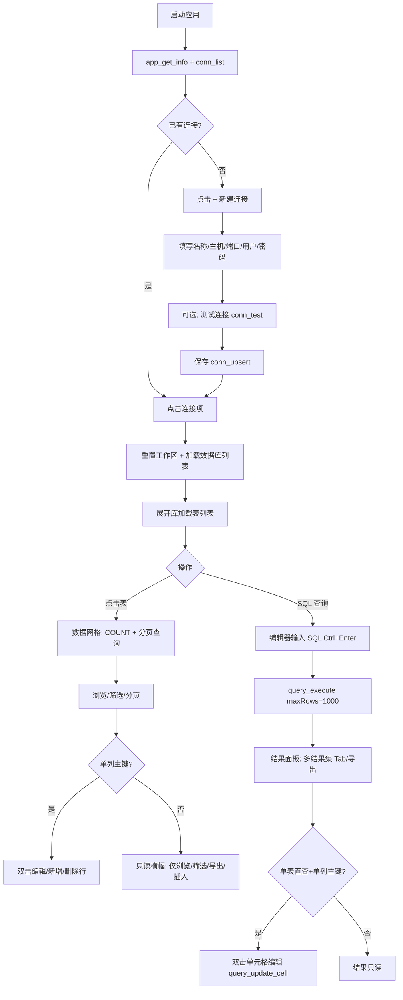
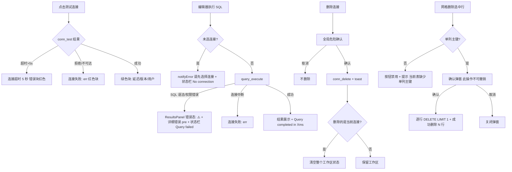
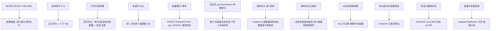
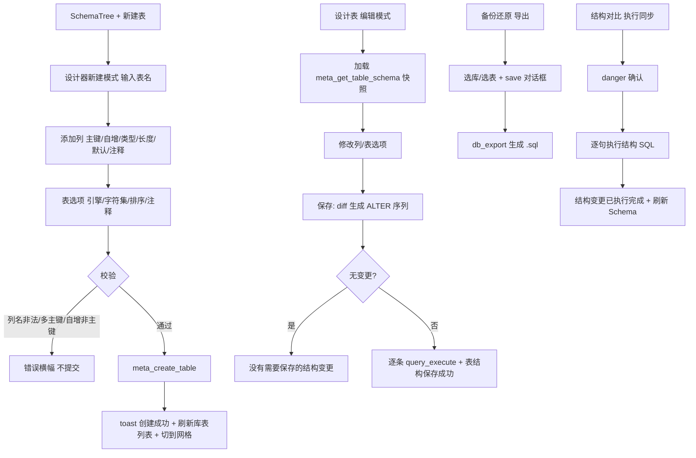
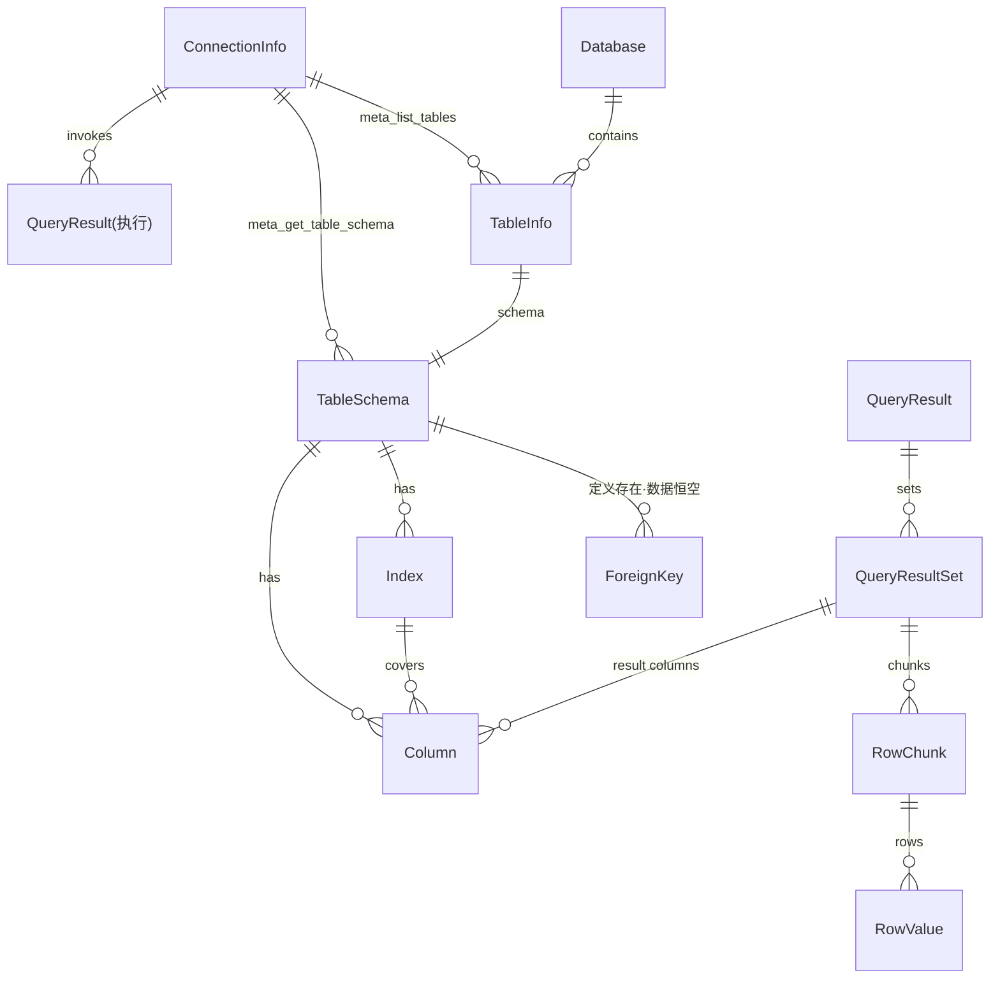

# QueryLab（lys-query-lab）旧项目逆向分析报告

> 分析对象：`/Users/luoyaosheng/Desktop/project/Open/QueryLab`
> 分析日期：2026-09-02
> 分析方式：逐文件阅读源代码（src / src-tauri）、既有文档（README.md、DEVELOPMENT.md、docs/*）、配置与测试，所有结论均可追溯到文件路径。
> 权威工作区约定：README.md 明确「默认以仓库根目录这套工作区为准」，故本报告以根目录 `src` + `src-tauri` 为准；`src-ui/` 为并行旧副本（见第 2 节）。

---

## ① 项目概述

### 1.1 产品定位

- 来源：`README.md` 第 10-17 行、`docs/PRD.md` 第 2 节。
- QueryLab 是一个**本地优先（local-first）的数据库工作台桌面应用**，首期聚焦 MySQL / MariaDB：
  - MySQL / MariaDB 首期支持
  - 本地桌面体验
  - 查询、结果查看、表数据处理
  - 后续再逐步扩到更多数据库和更重的能力
- `docs/PRD.md` 2.1 一句话定位：「面向开发者、测试和运维的本地优先数据库客户端」。
- 当前形态为 Tauri 桌面窗口（窗口 1400×900，最小 1000×600，可缩放；来源 `src-tauri/tauri.conf.json`）。

### 1.2 技术架构

- 来源：`README.md`「当前技术栈」、`package.json`、`src-tauri/Cargo.toml`、`vite.config.js`。

| 层 | 技术 | 版本 | 证据 |
|----|------|------|------|
| 前端框架 | Svelte（传统模式 + mount API） | ^5.43.8 | `package.json`、`src/main.js` |
| 构建工具 | Vite | ^7.2.4 | `package.json`、`vite.config.js` |
| SQL 编辑器 | CodeMirror 6（lang-sql / autocomplete / search / one-dark 等） | ^6.x | `package.json`、`src/components/SqlEditor.svelte` |
| 桌面壳 | Tauri 2 | ^2.9.6 (CLI) / 2 (Rust) | `package.json`、`src-tauri/Cargo.toml` |
| 后端语言 | Rust (edition 2021) | — | `src-tauri/Cargo.toml` |
| 数据库驱动 | mysql_async | 0.34 | `src-tauri/Cargo.toml` |
| 密钥存储 | keyring（系统钥匙串） | 1.1.0 | `src-tauri/Cargo.toml`、`src-tauri/src/security/mod.rs` |
| 本地配置目录 | dirs | 5 | `src-tauri/src/storage/connections.rs` |
| 测试 | vitest + @testing-library/svelte + jsdom | ^3.2.4 等 | `package.json`、`src/components/*.test.js` |

架构分层（`docs/PRD.md` 6.2 与实际代码一致）：

```text
Svelte UI（src/）
 ├── ConnectionManager（连接管理）
 ├── SchemaTree（Schema 浏览）
 ├── SqlEditor（CodeMirror 编辑器）
 ├── ResultsPanel（结果面板）
 ├── DataGrid（数据网格）
 ├── TableDesigner（表设计器）
 ├── DataSync（结构对比）
 ├── DatabaseBackup（备份还原）
 └── NotificationCenter（通知/确认）
        │  invoke()  @tauri-apps/api/core
Tauri Bridge（16 个已注册 command，src-tauri/src/main.rs；勘误：原文计 17，逐项清点实为 16，见 docs/06_review/PRODUCT_REVIEW.md A3）
        │
Rust Backend（src-tauri/src）
 ├── commands/（app / connection / query / metadata / backup）
 ├── db/（types.rs 数据模型 + driver.rs 抽象占位）
 ├── storage/（connections.json 读写）
 ├── security/（钥匙串密码读写）
 ├── core/（AppState/AppError 占位）
 └── util/（空占位）
```

### 1.3 用户类型

来源：`docs/PRD.md` 第 3 节。

| 用户类型 | 主要需求 |
|------|----------|
| 后端开发 | 查表、写 SQL、调试数据 |
| 测试 / QA | 验证数据、修正测试环境数据 |
| 运维 | 基础查询、导出、排障 |
| 数据分析 | 快速查询、结果导出 |

### 1.4 核心价值

- 来源：`README.md`「当前目标」、`docs/PRD.md` 第 1/9 节、`docs/RELEASE_CHECKLIST.md`「发布定位」。
- 本地优先、启动快、常用操作顺手的 MySQL 工作台：连接管理、Schema 浏览、SQL 编辑、结果面板、表数据基础能力。
- 明确边界（`docs/RELEASE_CHECKLIST.md`）：支持 MySQL/MariaDB 的连接管理、Schema 浏览、SQL 执行、数据网格、表结构编辑、SQL 备份导出/导入；「结构对比（预览）」仅提供结构差异分析与结构变更 SQL 执行，不宣称真实数据同步。

---

## ② 项目结构分析

### 2.1 仓库顶层结构

```text
QueryLab/
├── src/                 # 权威 Svelte 前端（含组件测试）
├── src-tauri/           # 权威 Rust / Tauri 后端
├── src-ui/              # 并行工作区旧副本（README 称"用于 UI / Tauri 联调整理"）
├── docs/                # PRD、API、发布文档、VitePress 站点
├── public/  index.html  vite.config.js  package.json
├── README.md  DEVELOPMENT.md
└── prototype/  docs/product/  # 本次逆向新增交付物（不属于旧项目原有结构）
```

### 2.2 src（前端，权威）

| 目录/文件 | 职责 |
|----|----|
| `src/main.js` | Svelte mount 入口 |
| `src/App.svelte` | 应用壳：顶栏导航（设置/帮助/关于）、侧栏（连接+Schema）、视图切换器（query/grid/design/sync/backup）、状态栏、shellPanel 侧滑面板、工作区状态管理与 query_execute 调度 |
| `src/app.css` | 全局 box-sizing / #app 满屏样式（9 行） |
| `src/components/ConnectionManager.svelte` | 连接列表、新建/编辑表单弹窗、测试连接、删除连接 |
| `src/components/SchemaTree.svelte` | 数据库/表树、新建数据库、右键菜单（刷新/重命名/清空/删除表）、新建表入口 |
| `src/components/SqlEditor.svelte` | CodeMirror 6 编辑器、批量模式、格式化、片段、历史面板、自动补全 |
| `src/components/ResultsPanel.svelte` | 多结果集 tab、导出 CSV/JSON、单元格编辑（单表直查+单列主键） |
| `src/components/DataGrid.svelte` | 表数据浏览/分页/筛选/单元格编辑/新增删除行/导出 CSV/JSON/SQL |
| `src/components/TableDesigner.svelte` | 新建表 / 编辑表结构（diff 生成 ALTER） |
| `src/components/DataSync.svelte` | 结构对比（预览）：源/目标库差异分析、SQL 生成/复制/导出/执行 |
| `src/components/DatabaseBackup.svelte` | SQL 备份导出 / 导入还原 |
| `src/components/NotificationCenter.svelte` | 全局 Toast 栈 + 全局确认对话框 |
| `src/components/BatchProgressPanel.svelte` | 批量执行进度面板（**未被 App.svelte 引用，未接线**） |
| `src/lib/notifications.js` | toast/confirm 的 Svelte store（notifySuccess/notifyError/notifyInfo/confirmAction） |
| `src/lib/Counter.svelte` | 模板残留死代码（10 行，无引用） |
| `src/components/*.test.js`、`src/test/setup.js` | vitest 组件测试（ConnectionManager / DataGrid / DatabaseBackup） |

### 2.3 src-tauri（后端，权威）

| 文件 | 职责 |
|----|----|
| `src-tauri/src/main.rs` | 注册 16 个 command（勘误：原文计 17，逐项清点实为 16，见 docs/06_review/PRODUCT_REVIEW.md A3）：app_get_info、conn_list、conn_upsert、conn_delete、conn_test、db_export、db_import、fs_write_file、meta_list_databases、meta_list_tables、meta_get_table_schema、meta_get_schema_tree、meta_create_database、meta_create_table、query_execute、query_update_cell |
| `src-tauri/src/commands/app.rs` | app_get_info（版本/平台/build）；fs_write_file（导出文件写入） |
| `src-tauri/src/commands/connection.rs` | 连接 CRUD + conn_test（5 秒超时，返回延迟/版本/用户/库） |
| `src-tauri/src/commands/query.rs` | query_execute（按 `;` 简单分句、SELECT/SHOW/DESCRIBE/EXPLAIN/WITH 走 query_iter、其余 query_drop、maxRows 截断）；query_update_cell（UPDATE ... LIMIT 1） |
| `src-tauri/src/commands/metadata.rs` | meta_list_databases / meta_list_tables（information_schema.TABLES，可含视图）/ meta_get_table_schema（列+索引+SHOW CREATE TABLE）/ meta_get_schema_tree（未被前端调用）/ meta_create_database / meta_create_table |
| `src-tauri/src/commands/backup.rs` | db_export（SQL/JSON/CSV 三格式，结构+数据，LIMIT 10000）/ db_import（读文件、可选 drop_existing、逐句执行、忽略 already exists/duplicate） |
| `src-tauri/src/db/types.rs` | 前后端共享数据模型：Column / Index / ForeignKey / TableSchema / QueryResultMeta / RowValue / QueryResultSet / RowChunk / PagingInfo |
| `src-tauri/src/db/driver.rs` | Driver/DbConnection trait 多数据库抽象（**占位未实现**）、ConnectionInfo / TableInfo / QueryOptions / ExecResult / DbError、MySQLDriver 空壳（TODO） |
| `src-tauri/src/storage/connections.rs` | connections.json 读写（配置目录 querylab/），密码迁移到钥匙串、保存时清除密码字段；含 2 个 Rust 单测 |
| `src-tauri/src/security/mod.rs` | keyring 封装（service `com.i2kai.querylab.connection`，按连接 id 存取密码） |
| `src-tauri/src/core/state.rs` | AppState/ConnManager/SessionManager/TaskManager 骨架（全部 TODO，dead_code） |
| `src-tauri/src/core/errors.rs` | AppError 统一错误码（DB_CONN_FAILED 等；**未被 commands 实际使用**，commands 直接返回 Result<T, String>） |
| `src-tauri/src/util/mod.rs` | 空（TODO） |
| `src-tauri/tauri.conf.json` | 窗口 1400×900 / min 1000×600 / productName QueryLab / identifier com.i2kai.querylab / shell 插件 open:true |
| `src-tauri/Cargo.toml` | 依赖清单（见 1.2） |

### 2.4 src-ui（并行旧副本）

- 来源：`README.md` 仓库结构注释「并行工作区副本，用于 UI / Tauri 联调整理」、`src-ui/README.md`。
- `diff -rq src src-ui/src` 结论：src-ui 缺少 `NotificationCenter.svelte`、`lib/notifications.js`、全部 `*.test.js`、`test/setup.js`；其余组件均有差异（src 为更新版本，与 `docs/CORE_LOGIC_REVIEW_2026-04-22.md` 描述的修正项一致）。src-ui 的 package.json 无测试依赖。
- 结论：**根目录工作区为权威版本**，本报告其余章节均以 src / src-tauri 为准；src-ui 仅作历史参考。

### 2.5 公共组件 / 服务层 / 数据层归纳

- 公共 UI 服务层：`src/lib/notifications.js`（Toast + 确认对话框 store，被 8 个组件引用）。
- 前端"服务层"即 Tauri invoke 调用：各组件直接 `invoke('<command>', {...})`，无独立 API 封装文件。
- 后端服务层：`commands/*`（Tauri 命令）→ `db`（类型+驱动）→ `storage`（连接持久化）→ `security`（钥匙串）。
- 本地数据文件：`{系统配置目录}/querylab/connections.json`（无密码字段）+ 系统钥匙串（密码）；SQL 历史 localStorage：`querylab_sql_history` / `querylab_sql_history_enabled`（`src/components/SqlEditor.svelte` L31-32）。

---

## ③ 页面清单表

> 说明：本项目是单窗口桌面应用，"页面"= 应用壳内的视图（viewMode）+ 独立弹层/面板。viewMode 定义见 `src/App.svelte` L28（'query' | 'grid' | 'design' | 'sync' | 'backup'）。

| 编号 | 页面 | 入口 | 文件 | 状态 |
|------|------|------|------|------|
| PAGE001 | 主工作台（应用壳：顶栏/侧栏/视图切换器/状态栏/新建表指示条） | 应用启动 | `src/App.svelte` | 已实现 |
| PAGE002 | 连接管理（侧栏列表 + 新建/编辑连接弹窗 + 测试结果块） | 侧栏「连接」区；列表项「+」「✎」「⚡」「✕」 | `src/components/ConnectionManager.svelte` | 已实现 |
| PAGE003 | Schema 浏览树（库/表树 + 新建数据库弹窗 + 表右键菜单 + 重命名/清空/删除确认弹窗） | 侧栏「Schema」区；「+ 数据库」按钮；表右键 | `src/components/SchemaTree.svelte` | 已实现 |
| PAGE004 | SQL 查询视图（工具栏 + CodeMirror 编辑器 + 历史侧栏 + 代码片段弹窗） | 视图切换器「SQL 查询」；默认视图 | `src/components/SqlEditor.svelte` | 已实现 |
| PAGE005 | 查询结果面板（多结果集 Tab + 导出 + 单元格编辑 + 五态） | SQL 查询视图下半区（ResultsPanel 挂载于 App.svelte） | `src/components/ResultsPanel.svelte` | 已实现 |
| PAGE006 | 数据网格视图（工具栏 + 表格 + 分页 + 删除确认弹窗） | 点击 SchemaTree 表名；视图切换器「数据网格」（选中表后出现） | `src/components/DataGrid.svelte` | 已实现 |
| PAGE007 | 表设计器（新建表 / 编辑表结构） | SchemaTree「新建表」；视图切换器「📋 设计表」（选中表后出现） | `src/components/TableDesigner.svelte` | 已实现 |
| PAGE008 | 结构对比（预览）（源/目标库比较 + 差异列表 + 详情面板 + SQL 操作） | 视图切换器「🔍 结构对比（预览）」 | `src/components/DataSync.svelte` | 已实现（预览形态，明确不做数据同步） |
| PAGE009 | 备份还原（导出备份 / 导入还原 双 Tab） | 视图切换器「💾 备份还原」 | `src/components/DatabaseBackup.svelte` | 已实现（仅 SQL 格式） |
| PAGE010 | 通知中心（全局 Toast 栈 + 全局确认对话框） | 全局挂载（App.svelte 首节点） | `src/components/NotificationCenter.svelte` + `src/lib/notifications.js` | 已实现 |
| PAGE011 | 设置 / 帮助 / 关于（右侧滑出面板） | 顶栏导航按钮 | `src/App.svelte`（shellPanel 状态） | 已实现（轻量内容面板） |
| PAGE012 | 批量执行进度面板 | 【未知——无入口】 | `src/components/BatchProgressPanel.svelte` | 部分实现（组件完成但未在 App.svelte 引用，未接线） |

---

## ④ 页面详细分析

### PAGE001 主工作台（应用壳）

- **目的**：承载连接区、Schema 区与五种工作视图的桌面主窗口。
- **入口**：应用启动（`src/main.js` mount）。
- **元素**：顶栏（logo「QueryLab」、导航按钮 设置/帮助/关于、版本信息 `v{version} ({build})`）；侧栏 280px（「连接」「Schema」两区）；视图切换器（SQL 查询 / 数据网格（选中表后出现）/ 📋 设计表（选中表后出现）/ 🔍 结构对比（预览）/ 💾 备份还原）；新建表指示条（📝 新建表: {db}）；底部状态栏（statusMessage + `平台: {platform}`）。
- **用户操作**：
  - 点击导航按钮 → 打开对应 shellPanel（`openShellPanel`，App.svelte L253）。
  - 点击视图按钮 → `setViewMode(mode)`；切回 query 时若 `currentTableName` 存在则自动执行 `SELECT * FROM \`db\`.\`table\` LIMIT 1000;` 并回填编辑器（L233-246）。
  - 选择连接（handleConnect）→ `resetWorkspaceState()` 重置全部工作区状态 → `loadDatabases()`（过滤 information_schema/mysql/performance_schema/sys）。
- **系统响应**：onMount 调 `app_get_info` + `conn_list`；初始化失败仅 console.error（L52-61）。
- **状态变化**：viewMode、currentTableName、currentDatabase、isCreatingNewTable、targetDatabase、databases、shellPanel、statusMessage（Ready/Connected to X/Executing.../Query completed in Xms/Query failed/Batch completed: N statements, Xms 等）。
- **异常情况**：未选连接执行 SQL → queryError='请先选择连接'、状态栏 'No connection'（L137-143）；loadDatabases 失败仅 console.error。
- **数据来源**：`app_get_info`、`conn_list`、`meta_list_databases`。

### PAGE002 连接管理

- **目的**：数据库连接的增删改查、连通性测试与选中连接。
- **入口**：侧栏「连接」区。
- **元素**：连接头（「连接」+ 新建按钮 +）；连接列表项（名称、host:port、编辑 ✎、测试 ⚡、删除 ✕）；空状态「暂无连接，点击 + 新建」；新建/编辑连接弹窗（连接名称/主机/端口/用户/密码 + 取消/测试/保存）；测试结果块（成功绿/失败红，含延迟、版本、用户）。
- **用户操作与响应**：
  - 新建：`openNewForm` 置空表单（driver 默认 'mysql'、port 默认 3306）。
  - 编辑：`openEditForm` 回填（driver 取 conn.driver || conn.driver_type；defaultDb 取 conn.defaultDb || conn.default_db）。
  - 保存：`conn_upsert`（返回 id）→ 重新 `conn_list` 刷新列表 → 关闭弹窗；失败显示「保存失败: err」。
  - 测试（列表项或表单内）：`conn_test` → 成功显示「连接成功!\n延迟: Xms\n版本: X\n用户: X」；失败「连接失败: err」；测试中按钮显示 '...' / '测试中...'。
  - 删除：先弹全局确认（title=删除连接，tone=danger）→ 确认后 `conn_delete` → toast「连接已删除」；若删除的是当前选中连接则 `onConnect(null)` 清空工作区。
  - 点击连接项：`selectConnection` → `onConnect(conn)`。
- **状态**：showForm、editingConnection、testingConnection、savingConnection、testResult。
- **异常**：保存/测试/删除失败均捕获并展示；弹窗支持点遮罩与 Esc 关闭。
- **数据来源**：`conn_upsert`、`conn_list`、`conn_test`、`conn_delete`。
- **已知问题（见⑨）**：`conn_list` 不回传密码（Rust 端 `#[serde(skip_serializing)] password`，driver.rs L64-65），编辑表单密码恒为空；若不重新输入密码直接保存，`storage.upsert` 会因密码为空调用 `delete_connection_password`，导致钥匙串密码被清空。

### PAGE003 Schema 浏览树

- **目的**：浏览当前连接的数据库/表/视图，并作为表操作与新建入口。
- **入口**：侧栏「Schema」区（需先选中连接）。
- **元素**：工具栏「+ 数据库」；库节点（▼/▶ + 📁 + 库名）；「+ 新建表」虚线按钮；表项（📊 表 / 👁️ 视图 + 名称 + 注释 tooltip）；加载/错误/空状态（请先选择连接 / 加载中... / 无可用数据库 / 无表）；新建数据库弹窗（库名 + 字符集下拉 6 项 + 排序规则联动下拉）；表右键菜单（🔄 刷新 / ✏️ 重命名表 / 🗑️ 清空表数据 / ❌ 删除表）；删除表确认弹窗（危险警告文案）；重命名表弹窗（原表名只读 + 新表名）；清空表确认弹窗。
- **用户操作与响应**：
  - 展开库 → `meta_list_tables(connection, db, includeViews:true)`（缓存于 tablesData）。
  - 点击表 → dispatch `selectTable` → App 切到 grid 视图。
  - 「+ 新建表」→ dispatch `createTable` → App 切到 design 视图（isCreatingNewTable=true）。
  - 新建数据库 → `meta_create_database({connection,name,charset,collation})` → toast 成功 → 刷新库列表并自动展开新库；空名报错「请输入数据库名称」；未连接报错。
  - 右键刷新：清缓存重载表列表。
  - 重命名：视图提示「视图不支持重命名」（notifyInfo）；表 → 弹窗 → `RENAME TABLE` via query_execute(maxRows:0) → toast「表重命名成功」→ 刷新。
  - 清空：视图提示「视图不支持清空」；表 → 确认弹窗 → `TRUNCATE TABLE` → toast「表数据已清空」。
  - 删除：确认弹窗（⚠️ 此操作不可撤销！表结构和数据将被永久删除！）→ `DROP TABLE` → toast「表删除成功」→ 刷新。
- **状态**：databases、tablesData、expandedDbs、loading/loadingTables、error、contextMenu{x,y,db,table,isView}、四个弹窗状态、tableOperating。
- **异常**：loadDatabases 失败显示错误文案；表操作失败 toast「XX失败: err」。
- **数据来源**：`meta_list_databases`、`meta_list_tables`、`meta_create_database`、`query_execute`（DDL）。
- **对外方法**：`refreshDatabase(db)`、`refreshAll()`（export function，供 App 在同步/建表后刷新）。

### PAGE004 SQL 查询视图（编辑器）

- **目的**：编写并执行 SQL（单条/批量/事务），辅以格式化、片段、历史、补全。
- **入口**：视图切换器「SQL 查询」；应用默认视图。
- **元素**：工具栏（▶ 运行/批量运行、⚡ 批量模式开关、🔒 事务（批量模式时出现）、⟡ 格式化、📋 片段、🕒 历史（会话/本地 + 条数）、清空、连接信息、快捷键提示）；CodeMirror 编辑器（oneDark 主题、行号、SQL 方言、占位符 `-- 输入 SQL 语句...`）；历史侧栏（开启/关闭本地保存、清空历史、提示条、搜索框（**未实现过滤逻辑**）、历史条目列表 SQL 前 150 字符 + 时间）；SQL 代码片段弹窗（24 个内置片段，双列网格）。
- **用户操作与响应**：
  - 执行：选中 SQL 优先，否则全文；无 SQL 直接返回；未连接 notifyError('请先选择连接')；保存历史后按 batchMode 分流 `onBatchExecute(sql, useTransaction)` 或 `onExecute(sql)`。
  - 批量+事务：App 端拼 `START TRANSACTION;\n{sql}\nCOMMIT;` 后整体调用 query_execute（App.svelte L185-189）。
  - 格式化（Ctrl+S）：空白标准化 → 关键字大写换行 → 缩进（SqlEditor L470-513）。
  - 片段（F1 / 📋）：弹窗点选插入编辑器光标处。
  - 历史（Ctrl+H）：点击条目回填编辑器；开启本地保存后含敏感词（password/secret/token/api_key/access_key/private_key/credential）的 SQL 不落盘；清空历史。
  - 清空（Ctrl+K）：setSql('')。
  - 快捷键：Ctrl+Enter 执行、Ctrl+S 格式化、Ctrl+H 历史、Ctrl+K 清空、F1 片段、Tab 缩进（keymap，L261-268）。
- **状态**：sql、showHistory、showSnippetDialog、batchMode、useTransaction、persistHistory、historyNotice、sqlHistory（上限 MAX_HISTORY=100）、tableNames/columnNames（补全用，**无填充来源**）。
- **异常**：执行错误由 App 统一进 ResultsPanel 错误态。
- **数据来源**：localStorage（历史）；invoke 由 App 完成；内置 sqlKeywords（约 120 个）与 dataTypes 补全词表、24 个 snippets 常量。
- **已知问题（见⑨）**：方言检测读 `connection.dialect`，实际字段为 `driver`（driver.rs serde rename），MySQL 高亮退化为 StandardSQL；`parseStatements` 智能分句函数已实现并 export 但从未被调用；历史搜索框无过滤逻辑；`updateTableNames` 无人调用（表名补全实际为空）。

### PAGE005 查询结果面板

- **目的**：展示 query_execute 结果（多结果集）、导出、受限单元格编辑。
- **入口**：SQL 查询视图下半区。
- **元素**：五态（加载 spinner「执行中...」/ 错误 ⚠️ + pre 详情 / 空态「执行 SQL 后结果显示在这里」/ 无列无块时「执行成功，影响 N 行」/ 数据表格）；结果 Tab「结果 N (行数)」；导出按钮 CSV / JSON（canExport 时）；信息条（耗时 Xms、查询ID 前 8 位、可编辑时「双击单元格编辑」提示）；更新消息条（成功绿/失败红）；表格（列名 + 类型副行、主键列 🔑 与特殊底色、NULL 斜体灰、数字绿、字符串橙、bytes [N bytes]）；单元格编辑器（输入框 + ✓ 保存 + ✗ 取消 + NULL 开关）。
- **用户操作与响应**：
  - 切换结果 Tab；导出 CSV/JSON（Tauri save 对话框 → fs_write_file，失败降级浏览器下载；文件名 `{表名去库前缀}_export.csv`）。
  - 双击可编辑单元格 → 编辑器 → Enter/✓ 保存（`query_update_cell`，params 含 is_null）→ 成功提示 + 500ms 后自动刷新（onRefresh）；Esc/✗ 取消；NULL 开关切换置空。
- **编辑门禁**（isEditable）：connection && editableTableName && 结果集列非空 && 存在单列 PRIMARY && 该主键列出现在结果列中（L196-205）。editableTableName 仅当 SQL 为单条 `SELECT * FROM \`db\`.\`table\`[ LIMIT n]` 且结果 sets.length===1 时非空（App.svelte extractEditableTableName L75-92）。
- **状态**：editingCell、updateLoading、updateMessage、activeSetIndex、exportLoading（**恒 false，从未置真**）、tableSchema、schemaKey、lastQueryId（新结果到达时重置 tab 与编辑态）。
- **异常**：查询错误显示 error 文本；更新失败「更新失败: err」；schema 加载失败静默降级为不可编辑。
- **数据来源**：props（result/loading/error/connection/tableName/editableTableName）；`meta_get_table_schema`、`query_update_cell`、`fs_write_file`。

### PAGE006 数据网格视图

- **目的**：Navicat 风格的表数据浏览与编辑（分页、筛选、CRUD、导出）。
- **入口**：SchemaTree 点击表；视图切换器「数据网格」。
- **元素**：工具栏（↻ 刷新、+ 新增、- 删除 (N)、分隔线、CSV/JSON/SQL 导出、右侧筛选输入框 + 列选择（所有列/具体列）+ 筛选按钮 + 清除按钮）；消息横幅（成功/失败 + ×关闭）；只读降级横幅（无单列主键时）；表格（# 行号列、复选框列、列名+类型、主键列高亮 🔑、NULL 显示、行悬停/选中/编辑/新行底色）；空表占位（📭 此表当前没有数据 + 表名）；分页条（第 X / Y 页，共 N 行 / 空表；< 上一页、页码输入、> 下一页）；删除确认弹窗。
- **用户操作与响应**：
  - 进入/切表：`meta_get_table_schema` → `SELECT COUNT(*)` → `SELECT * ... LIMIT 50 OFFSET n`（pageSize=50）。
  - 分页：上/下页、跳页（gotoPage 校验 1..totalPages）。
  - 筛选：输入 + 回车/按钮 → WHERE 拼接（指定列 `\`col\` LIKE '%esc%'` 或全列 OR；escapeSqlString 转义 \ 和 '）；清除按钮重置。
  - 编辑：双击非主键单元格（需单列主键）→ 输入 → Enter 保存（拼 `UPDATE ... SET ... WHERE pk ... LIMIT 1` 执行）→ 刷新 + 「更新成功」；Esc 取消；Tab 移到下一列。
  - 新增行：`addRow` 追加临时空行并进入逐列编辑；最后一列保存时 INSERT（排除 auto_increment 列，兜底按整型主键推断；quoteValue 引用与 NULL 处理）→ 刷新 + 「插入成功」。
  - 删除：勾选行（单选/全选）→ 确认弹窗 → 逐行 `DELETE ... LIMIT 1` → 「成功删除 N 行」。
  - 导出：CSV / JSON / SQL INSERT（save 对话框 + fs_write_file + 降级下载，成功提示「导出成功: 文件名」）。
- **门禁**：`supportsRowMutation()` = 存在单列 PRIMARY 且在结果列中；否则编辑/删除禁用并显示只读横幅（「当前表未检测到单列主键，网格视图仅支持浏览、筛选、导出和插入；更新与删除已禁用。」）。
- **状态**：data{columns,rows,totalRows}、tableSchema、loading、error、isEmptyTable、currentPage/pageSize/totalPages、editingCell{rowIndex,colIndex,value,isNew}、newRows、selectedRows、updateMessage、showDeleteConfirm、filterText/filterColumn。
- **异常**：加载失败 error 文本；操作失败消息横幅；无列显示「无数据」。
- **数据来源**：`meta_get_table_schema`、`query_execute`（COUNT/SELECT/UPDATE/INSERT/DELETE）。

### PAGE007 表设计器

- **目的**：可视化新建表 / 编辑既有表结构（列 + 表选项）。
- **入口**：SchemaTree「+ 新建表」（新建模式，targetDatabase）；视图切换器「📋 设计表」（编辑模式，currentTableName）。
- **元素**：头部（📝/📋 图标 + 标题（新建模式含表名输入框）、「有未保存的更改」指示、关闭/保存按钮）；错误横幅；加载态；列表格（主键/自增/列名/类型（6 分组下拉：整数/浮点数/字符串/二进制/日期时间/其他）/长度（按类型显示）/NULL/默认值/注释/删除 🗑️）；表选项区（存储引擎 InnoDB/MyISAM/MEMORY/ARCHIVE/CSV、字符集 utf8mb4/utf8/latin1/gbk/big5、排序规则 7 项、表注释）。
- **用户操作与联动规则**：
  - 添加列（默认 VARCHAR(255) 可空）；删除列；修改列属性。
  - 勾主键 → 自动 NOT NULL；勾自增 → 自动主键 + NOT NULL；主键列的 NULL/自增复选框受禁用联动（nullable disabled={col.primaryKey}、autoIncrement disabled={!col.primaryKey}）。
  - 保存（新建）：校验（至少一列、列名非空且 `^[a-zA-Z_][a-zA-Z0-9_]*$`、自增必须主键、**仅支持单列主键**）→ `meta_create_table`（列定义/引擎/字符集/排序/注释）→ toast 返回消息 → onRefresh。
  - 保存（编辑）：基于 originalColumns/originalTableInfo 快照 diff 生成 ALTER 语句序列（DROP PRIMARY KEY / DROP COLUMN / ADD COLUMN(+PRIMARY KEY) / CHANGE COLUMN（重命名）/ MODIFY COLUMN / ADD PRIMARY KEY / 表选项 ALTER）逐条 query_execute → 「表结构保存成功」；无变更 → 「没有需要保存的结构变更」。
- **状态**：newTableName、columns、originalColumns、indexes（加载自 schema.indexes，但**无可视化编辑 UI**）、tableInfo/originalTableInfo、loading、saving、error、hasChanges、lastMode。
- **异常**：校验失败 error 横幅；执行失败「保存失败: err」。
- **数据来源**：`meta_get_table_schema`、`meta_create_table`、`query_execute`。

### PAGE008 结构对比（预览）

- **目的**：比较同连接下两个数据库的表结构差异，生成/复制/导出/执行结构变更 SQL。**明确不做真实数据同步**（页面顶部 mode-note 文案）。
- **入口**：视图切换器「🔍 结构对比（预览）」。
- **元素**：头部（标题「结构对比」+ 关闭 ×，关闭 dispatch close → App 切回 query）；配置区（源数据库下拉 → 目标数据库下拉、同步模式下拉（disabled，仅「仅结构（当前支持）」）、开始比较按钮）；错误块；统计条（源表数/目标表数/新增表/删除表/差异表/已选中）；差异列表（全选复选框 + 差异行：复选框、表名、状态徽标 新增/删除/有差异、+N 列/-N 列/~N 列/索引差异）；详情面板（列差异六列表格：列名/状态/源类型/目标类型/可空/默认值；索引差异提示；同步 SQL 预览 pre）；操作按钮（📋 复制 SQL / 💾 导出 SQL / ▶ 执行同步）。
- **用户操作与响应**：
  - 开始比较：校验（两库必选、不能相同）→ 并行 `meta_list_tables`（不含视图）→ 共同表逐个 `meta_get_table_schema` 比较列（新增/删除/类型修改）与索引集合差异 → 汇总 tableDifferences，默认全选。
  - 表行点击 → 详情面板（getDetailData 组装列级对比 + SQL 预览）。
  - 复制 SQL：navigator.clipboard，成功/失败 toast。
  - 导出 SQL：浏览器下载 `sync_{src}_to_{dst}_{ts}.sql`。
  - 执行同步：全局 danger 确认（「此操作会直接修改目标数据库结构，且不可撤销。建议先完成 SQL 备份。」）→ 按 `;` 分句过滤注释逐条 query_execute → 「结构变更已执行完成」→ dispatch syncComplete（App 刷新 SchemaTree + 数据库列表）。
  - 差异为空 → 「没有发现结构差异，两个数据库结构相同」。
- **状态**：sourceDatabase/targetDatabase、syncMode='structure'、comparing、syncResult、syncError、selectedTables、showDetailPanel/detailTable、tableDifferences、syncing。
- **异常**：比较失败 syncError 块；新增表在生成 SQL 中仅注释提示「需要手动创建」。
- **数据来源**：`meta_list_tables`、`meta_get_table_schema`、`query_execute`。
- **已知问题（见⑨）**：详情面板「修改列类型」SQL 预览写在 JS 模板字符串内，`{targetDatabase}`/`{detailData.table}` 未插值为字面量文本（DataSync.svelte L660-665）。

### PAGE009 备份还原

- **目的**：SQL 备份导出与导入还原（仅 SQL 格式）。
- **入口**：视图切换器「💾 备份还原」。
- **元素**：头部（📤 导出备份 / 📥 导入还原 Tab + 关闭 ×）；导出面板（选择数据库下拉 → 表多选网格（全选/取消全选）→ 导出类型单选「结构 + 数据（SQL）」→ 导出格式静态文本「仅支持 SQL (.sql)」→ 开始导出按钮 + 进度条 + 状态文本 + 结果块）；导入面板（模式提示「当前导入仅支持 SQL 备份文件。」、目标数据库下拉、备份文件选择（readonly 输入 + 「浏览 SQL」按钮）、「导入前删除现有表（谨慎使用）」复选框、开始导入按钮 + 进度条 + 结果块（导入表数/行数））。
- **用户操作与响应**：
  - 选库后 `meta_list_tables(includeViews:false)` 加载表并默认全选。
  - 导出：校验（选库、至少一表）→ Tauri save 对话框（默认名 `{db}_backup_{ts}.sql`，取消则 notifyInfo「已取消导出」）→ `db_export{connection,database,tables,export_type:'both',format:'sql',file_path}` → 进度 100%、结果块（保存位置/表数量）、toast「备份导出成功」；失败红色结果块 + toast。
  - 导入：校验（选库、选文件）→ `db_import{connection,database,file_path,drop_existing}` → 结果块（表数/行数估算）；失败红色结果块。
- **状态**：selectedDatabase、selectedTables、availableTables、exportType='both'、isExporting/exportProgress/exportStatus/showResult/exportResult、importMode、importFile、importDropExisting、isImporting/importProgress/importStatus/importResult。
- **异常**：导出/导入失败均有错误结果块与 toast。
- **数据来源**：`meta_list_tables`、`db_export`、`db_import`。

### PAGE010 通知中心

- **目的**：统一 Toast 通知与全局确认对话框（替代浏览器 alert/confirm，见 docs/RELEASE_VERIFICATION）。
- **入口**：App.svelte 全局挂载 `<NotificationCenter />`；业务代码调用 notifySuccess/notifyError/notifyInfo/confirmAction。
- **元素**：右上角 Toast 栈（success 绿 / error 红 / info 蓝，默认 3.2s 自动消失、error 4.5s、每条 × 手动关闭）；确认遮罩 + 对话框（标题、正文、取消/确认按钮，tone=danger 红 / info 蓝）。
- **行为**：confirmAction 返回 Promise<boolean>；同时只保留一个确认（新的确认会 resolve(false) 旧的）；遮罩点击与 Esc 均视为取消。
- **数据来源**：`src/lib/notifications.js` 的 toastStore/confirmStore（svelte writable）。

### PAGE011 设置 / 帮助 / 关于（侧滑面板）

- **目的**：轻量信息面板（docs/RELEASE_VERIFICATION 明确「仍是轻量版面板，不是完整独立页面」）。
- **入口**：顶栏「设置」「帮助」「关于」。
- **元素**：右侧 420px 滑出面板（QueryLab eyebrow + 标题 + × 关闭）；内容分节卡片：
  - 设置：安全与存储（密码入钥匙串、SQL 历史默认会话、备份仅 SQL）；当前限制（结构对比仅结构、结果面板仅单表直查可编辑）。
  - 帮助：快速开始 4 步；核心能力边界；快捷键列表（Ctrl+Enter/Ctrl+S/Ctrl+H/Ctrl+K/F1）。
  - 关于：应用信息（版本/平台/构建）；定位；当前发布阶段。
- **异常/关闭**：遮罩点击、Esc、× 均关闭。

### PAGE012 批量执行进度面板（未接线）

- **目的**：批量执行多语句时的逐条进度展示（总计/成功/失败统计、语句列表含类型图标、错误详情）。
- **入口**：【未知】——组件 `export let show` 由父级控制，但 App.svelte 未 import 该组件。
- **状态**：部分实现（组件代码完整，未接入运行链路）。

---

## ⑤ 功能清单表

| ID | 功能 | 入口 | 实现位置 | 状态 |
|----|------|------|----------|------|
| F001 | 新建/编辑连接（名称/主机/端口/用户/密码） | 连接区 + / ✎ | ConnectionManager.svelte；commands/connection.rs conn_upsert | 已实现 |
| F002 | 连接列表展示与选择连接 | 连接区列表项 | ConnectionManager.svelte；conn_list | 已实现 |
| F003 | 测试连接（延迟/版本/用户） | ⚡ / 表单「测试」 | ConnectionManager.svelte；conn_test（5s 超时） | 已实现 |
| F004 | 删除连接（危险确认 + 联动清空工作区） | ✕ | ConnectionManager.svelte + NotificationCenter；conn_delete | 已实现 |
| F005 | 连接密码钥匙串存储（不落盘） | 保存连接时自动 | security/mod.rs、storage/connections.rs | 已实现 |
| F006 | 数据库列表加载（过滤系统库） | 选中连接 | App.svelte loadDatabases、SchemaTree loadDatabases；meta_list_databases | 已实现 |
| F007 | 展开库加载表列表（区分表/视图、注释、缓存） | 点击库节点 | SchemaTree.svelte；meta_list_tables | 已实现 |
| F008 | 新建数据库（字符集/排序规则联动） | 「+ 数据库」 | SchemaTree.svelte；meta_create_database | 已实现 |
| F009 | 新建表入口（进入设计器新建模式） | 库下「+ 新建表」 | SchemaTree→App handleCreateTable | 已实现 |
| F010 | 表右键菜单（刷新） | 表右键 | SchemaTree.svelte refreshTableList | 已实现 |
| F011 | 重命名表（视图拦截） | 右键「重命名表」 | SchemaTree.svelte；RENAME TABLE via query_execute | 已实现 |
| F012 | 清空表数据（确认 + 视图拦截） | 右键「清空表数据」 | SchemaTree.svelte；TRUNCATE via query_execute | 已实现 |
| F013 | 删除表（危险确认） | 右键「删除表」 | SchemaTree.svelte；DROP via query_execute | 已实现 |
| F014 | SQL 编辑器（CodeMirror6/行号/主题/方言/折行/搜索高亮） | SQL 查询视图 | SqlEditor.svelte | 已实现（方言检测字段不匹配，见⑨） |
| F015 | 执行 SQL（Ctrl+Enter/选中优先，maxRows=1000） | ▶ 运行 | SqlEditor execute → App.executeQuery → query_execute | 已实现 |
| F016 | 批量执行模式 + 事务包装 | ⚡ 批量模式 / 🔒 事务 | SqlEditor batchMode → App.handleBatchExecute | 已实现 |
| F017 | SQL 格式化 | ⟡ 格式化 / Ctrl+S | SqlEditor.svelte format() | 已实现 |
| F018 | SQL 代码片段（24 个内置） | 📋 片段 / F1 | SqlEditor.svelte snippets | 已实现 |
| F019 | SQL 历史（会话/本地可选、敏感过滤、上限 100、清空） | 🕒 历史 / Ctrl+H | SqlEditor.svelte + localStorage | 已实现（搜索框无过滤逻辑） |
| F020 | SQL 自动补全（关键字/类型/表名上下文） | 编辑器输入 | SqlEditor.svelte createCompletionSource | 部分实现（列名无来源；tableNames 无填充） |
| F021 | 编辑器内搜索（CodeMirror searchKeymap） | Ctrl+F（CM 内置） | SqlEditor.svelte extensions | 已实现 |
| F022 | 清空编辑器 | 「清空」/ Ctrl+K | SqlEditor.svelte clear() | 已实现 |
| F023 | 多结果集 Tab 切换 | 结果面板 Tab | ResultsPanel.svelte activeSetIndex | 已实现 |
| F024 | 结果导出 CSV / JSON | 结果面板 CSV/JSON 按钮 | ResultsPanel.svelte + fs_write_file | 已实现（文件名依赖 tableName 可为空） |
| F025 | 结果面板单元格编辑（单表直查 + 单列主键 + NULL 开关） | 双击单元格 | ResultsPanel.svelte；query_update_cell | 已实现 |
| F026 | 值类型渲染（NULL/数字/字符串/bytes/主键高亮） | 结果表格 | ResultsPanel.svelte formatValue | 已实现 |
| F027 | 结果五态（加载/错误/空/成功消息/数据） | 查询生命周期 | ResultsPanel.svelte | 已实现 |
| F028 | 表数据浏览（COUNT + LIMIT/OFFSET，pageSize=50） | 进入数据网格 | DataGrid.svelte loadData | 已实现 |
| F029 | 分页导航（上下页/跳页） | 网格分页条 | DataGrid.svelte | 已实现 |
| F030 | 数据筛选（列/全列 LIKE + 转义 + 清除） | 网格工具栏 | DataGrid.svelte buildWhereClause | 已实现 |
| F031 | 网格单元格编辑（UPDATE LIMIT 1 + 单列主键门禁） | 双击单元格 | DataGrid.svelte updateCell | 已实现 |
| F032 | 新增行（逐列录入 + 自增列排除 INSERT） | 「+ 新增」 | DataGrid.svelte insertNewRow | 已实现 |
| F033 | 删除选中行（确认 + 逐行 DELETE） | 「- 删除 (N)」 | DataGrid.svelte executeDelete | 已实现 |
| F034 | 行选择（单选/全选，无主键禁用） | 复选框列 | DataGrid.svelte toggleRowSelection/toggleSelectAll | 已实现 |
| F035 | 网格导出 CSV / JSON / SQL INSERT | 工具栏 CSV/JSON/SQL | DataGrid.svelte exportCSV/exportJSON/exportSQL | 已实现 |
| F036 | 空表状态（表头 + 📭 占位） | 空表进入网格 | DataGrid.svelte | 已实现 |
| F037 | 只读降级提示（无单列主键横幅） | 无主键表 | DataGrid.svelte readonly-banner | 已实现 |
| F038 | 新建表（列/主键/自增/引擎/字符集/排序/注释） | 设计器新建模式 | TableDesigner.svelte；meta_create_table | 已实现 |
| F039 | 编辑表结构（快照 diff → ALTER 序列） | 设计器编辑模式 | TableDesigner.svelte generateAlterSQL | 已实现 |
| F040 | 列增删与属性联动（主键→NOT NULL、自增→主键） | 设计器列表格 | TableDesigner.svelte updateColumn | 已实现 |
| F041 | 表结构校验（列名规则/单主键限制） | 保存时 | TableDesigner.svelte validateSchema | 已实现 |
| F042 | 未保存更改提示 | 设计器头部 | TableDesigner.svelte hasChanges | 已实现 |
| F043 | 源/目标库结构比较（表/列/索引差异） | 「开始比较」 | DataSync.svelte startCompare | 已实现 |
| F044 | 差异列表与统计（新增/删除/修改、±~列、索引差异） | 比较结果区 | DataSync.svelte | 已实现 |
| F045 | 表差异详情面板（列对比表 + SQL 预览） | 点击差异行 | DataSync.svelte getDetailData | 已实现（修改列 SQL 预览有插值 bug） |
| F046 | 同步 SQL 生成（复制/导出 .sql） | 📋/💾 按钮 | DataSync.svelte copySQL/exportSQL | 已实现 |
| F047 | 执行结构变更（危险确认 + 逐句执行 + 完成刷新） | ▶ 执行同步 | DataSync.svelte executeSync | 已实现 |
| F048 | 备份导出（SQL 结构+数据、表多选、进度、结果） | 📤 导出备份 | DatabaseBackup.svelte；db_export | 已实现（仅 SQL） |
| F049 | 备份导入（选 .sql、可选先删现有表） | 📥 导入还原 | DatabaseBackup.svelte；db_import | 已实现（分句简化） |
| F050 | 设置/帮助/关于侧滑面板 | 顶栏导航 | App.svelte shellPanel | 已实现（轻量） |
| F051 | 全局 Toast 通知（三级 + 自动消失 + 手动关） | 全局 | notifications.js + NotificationCenter.svelte | 已实现 |
| F052 | 全局确认对话框（danger/info、遮罩/Esc 取消） | 危险操作 | notifications.js confirmAction | 已实现 |
| F053 | 状态栏（状态消息 + 平台） | 底部 | App.svelte | 已实现 |
| F054 | 应用信息展示（版本/构建/平台） | 顶栏 + 关于面板 | App.svelte；app_get_info | 已实现 |
| F055 | 视图切换器（5 视图条件显示与回查自动执行） | 工作区顶部 | App.svelte setViewMode | 已实现 |
| F056 | 单元格更新（后端专用命令） | 结果面板编辑 | commands/query.rs query_update_cell | 已实现 |
| F057 | 文件写入（导出落盘，自动建目录） | 导出链路 | commands/app.rs fs_write_file | 已实现 |

> 未纳入编号但存在的能力：`meta_get_schema_tree`（后端已注册、前端未调用）、BatchProgressPanel（组件未接线）——见第⑨节。

---

## ⑥ 用户流程（Mermaid）

### 流程组 1：正常主流程（连接 → 浏览 → 查询 → 编辑）



### 流程组 2：异常流程（连接失败 / SQL 报错 / 删除保护）



### 流程组 3：边界流程（空结果 / 空表 / 结构差异 / 批量+事务 / 敏感历史）



### 流程组 4：表结构生命周期（新建 → 修改 → 备份 → 结构同步）



---

## ⑦ 数据模型

### 7.1 连接配置（ConnectionInfo）

- 定义：`src-tauri/src/db/driver.rs` L55-69（serde 字段名即前后端 JSON 契约）。

| 字段 | JSON 名 | 类型 | 说明 |
|----|---------|------|------|
| id | id | String | UUID（conn_upsert 时为空则后端生成） |
| name | name | String | 连接名称 |
| driver_type | **driver** | String | 驱动类型（前端表单默认 'mysql'） |
| host | host | String | 主机 |
| port | port | u16 | 端口（表单默认 3306） |
| user | user | String | 用户 |
| password | （skip_serializing） | String | 密码：**不出现在任何序列化输出**，存系统钥匙串 |
| default_db | **defaultDb**（Option） | Option<String> | 默认库 |

- 持久化：`{dirs::config_dir()}/querylab/connections.json`（数组；保存时密码字段被 clear；读取时发现明文密码自动迁移入钥匙串）。钥匙串 service=`com.i2kai.querylab.connection`，account=连接 id。
- 测试结果 ConnectionTestResult：`latency_ms: u64`、`server_version: String`、`user: String`、`default_db: Option<String>`（connection.rs L45-51）。

### 7.2 元数据（TableInfo / Column / Index / ForeignKey / TableSchema）

- `db/types.rs` + `db/driver.rs`：
  - TableInfo：name、type（BASE TABLE/VIEW）、comment?、engine?、rowsEst（来自 information_schema.TABLES）。
  - Column：name、type（COLUMN_TYPE）、nullable、default?、comment?、extra?（如 auto_increment）。
  - Index：name、unique、columns[]（information_schema.STATISTICS 聚合）。
  - ForeignKey：name、columns[]、refTable、refColumns[] —— **类型已定义但 meta_get_table_schema 恒返回空数组**（metadata.rs L368）。
  - TableSchema：database、table、columns[]、indexes[]、foreign_keys[]、create_sql?（SHOW CREATE TABLE）。

### 7.3 查询结果（QueryResult 系列）

- `commands/query.rs` + `db/types.rs`：
  - QueryResult：queryId（uuid）、sets[]、elapsedMs。
  - QueryResultSet：setIndex、columns[]、meta{columns[], affectedRows, elapsedMs, warningCount}、chunks[{chunkIndex, rows[][]}]、paging（Option，当前恒 None）。
  - RowValue（untagged enum）：Null | Bool | Number(i64) | Float | String | Bytes([u8])。
  - UpdateCellParams：connection、table（db.table）、column、primary_key、primary_key_value、new_value、is_null；UpdateCellResult：success、message、affectedRows。

### 7.4 SQL 历史（前端 localStorage）

- key `querylab_sql_history`：`[{sql, timestamp, date}]`，去重后最新在前，上限 100 条。
- key `querylab_sql_history_enabled`：'true'/'false'（默认 false，仅会话）。
- 敏感词正则（SqlEditor.svelte L33-41）：password / secret / token / api[_-]?key / access[_-]?key / private[_-]?key / credential（不区分大小写）。

### 7.5 代码片段（前端常量）

- SqlEditor.svelte `snippets`：24 个 {name, sql}（SELECT 基础/指定列、INSERT/多行、UPDATE/多列、DELETE/多条件、CREATE TABLE、CREATE INDEX、ALTER TABLE、DROP TABLE、TRUNCATE、JOIN/LEFT/RIGHT、GROUP BY、子查询、EXISTS、UNION、事务、批量插入、创建视图、WITH 递归）。

### 7.6 备份导出/导入

- ExportParams：connection、database、tables[]、export_type（structure/data/both）、format（sql/json/csv）、file_path；ExportResult：success、size、tables、message。
- ImportParams：connection、database、file_path、drop_existing；ImportResult：success、tables、rows、message。
- 备份文件格式：SQL 文本（头部注释 + USE 库 + 每表 DROP IF EXISTS + CREATE TABLE + INSERT（每表上限 10000 行））。

### 7.7 关系图



---

## ⑧ 外部依赖

### 8.1 Rust（src-tauri/Cargo.toml）

| 依赖 | 版本 | 用途 |
|------|------|------|
| tauri | 2 | 桌面应用框架/命令桥 |
| tauri-plugin-shell | 2 | shell open（tauri.conf.json plugins.shell.open=true） |
| mysql_async | 0.34 | MySQL/MariaDB 异步驱动（所有命令直连，无连接池） |
| keyring | 1.1.0 | 系统钥匙串（连接密码） |
| dirs | 5 | 系统配置目录（connections.json） |
| uuid | 1.11 (v4, serde) | 连接 id / queryId |
| chrono | 0.4 | 备份文件时间戳 |
| tokio | 1 (full) | 异步运行时（conn_test 5s 超时） |
| serde / serde_json | 1.0 | 序列化 |
| anyhow / thiserror / async-trait | 1 / 2 / 0.1 | 错误处理与 trait 异步（driver 占位使用） |

### 8.2 前端（package.json dependencies）

| 依赖 | 用途 |
|------|------|
| @tauri-apps/api ^2.10.1 | invoke 调用后端 |
| @tauri-apps/plugin-dialog ^2.4.2 | save/open 文件对话框（导出/导入） |
| codemirror ^6.0.2 + @codemirror/{state,view,commands,lang-sql,autocomplete,search,theme-one-dark} | SQL 编辑器全家桶 |
| svelte ^5.43.8 / vite ^7.2.4（dev 也含 vitest、@testing-library/svelte、jsdom） | 框架/构建/测试 |

### 8.3 数据库与服务

- 目标数据库：MySQL / MariaDB（TCP 直连，无 SSL/SSH 参数，来源 build_mysql_opts/OptsBuilder）。
- 无任何网络 API / CDN 依赖；数据全部本地（连接配置 + 钥匙串 + localStorage 历史）。

### 8.4 information_schema 依赖 SQL（metadata.rs）

- SCHEMATA（库列表）、TABLES（表/视图/注释/引擎/行数估计）、COLUMNS（列详情）、STATISTICS（索引）、SHOW CREATE TABLE（建表 SQL）。

---

## ⑨ 未完成能力

### 9.1 已实现（可用）

- 连接管理全流程（增删改查/测试/钥匙串密码/重启恢复）。
- Schema 浏览（库/表/视图、注释、系统库过滤、缓存展开）。
- SQL 编辑执行主链路（CodeMirror 高亮、选中执行、多结果集、批量+事务、格式化、片段、历史含敏感过滤、快捷键）。
- 结果面板（五态、多 Tab、CSV/JSON 导出、单表直查 + 单列主键的受限单元格编辑）。
- 数据网格（分页/筛选/单元格编辑/新增/删除/CSV/JSON/SQL 导出/空表/只读降级）。
- 表设计器（新建 meta_create_table；编辑快照 diff 生成 ALTER：增列/删列/改类型/重命名/主键切换/表选项）。
- 结构对比（预览）（表/列/索引差异、详情、SQL 生成/复制/导出/危险确认执行）。
- 备份还原（SQL 导出/导入，可选先删现有表）。
- 全局通知/确认层、状态栏、设置/帮助/关于轻量面板。
- 自动化测试：3 个组件协议测试 + 2 个 Rust 存储单测 + 1 个 format_table_ident 单测（`npm test` / `cargo test`）。

### 9.2 部分实现（受限形态）

| 能力 | 现状 | 缺口 | 证据 |
|------|------|------|------|
| 结构对比 | 仅结构差异分析与结构 SQL 执行 | 不做真实数据同步；「新增表」仅生成注释需手动建表 | DataSync.svelte L14/L219-224；RELEASE_CHECKLIST 发布定位 |
| SQL 自动补全 | 关键字 + 数据类型 + 上下文表名 | tableNames 无任何填充来源（updateTableNames 无人调用）；列名补全未实现 | SqlEditor.svelte L533-537 注释"可选" |
| MySQL 方言高亮 | 有 lang-sql 方言切换逻辑 | 读取 `connection.dialect`，实际字段名为 `driver`，实际恒退化为 StandardSQL | SqlEditor.svelte L249 vs driver.rs L59-60 |
| SQL 分句 | 前端 parseStatements 支持字符串/注释/DELIMITER 检测 | 从未被调用；后端 query_execute 仅按 `;` 简单 split | SqlEditor.svelte L371-467；query.rs L120-124 |
| 备份导入 | 可执行 .sql | split_sql_statements 不处理注释内分号/DELIMITER/存储过程，错误静默忽略范围有限 | backup.rs L312-346、L191-198 |
| 结果面板导出 | CSV/JSON 可用 | 文件名取 currentTableName（可为空 → `_export.csv`）；exportLoading 恒 false | ResultsPanel.svelte L25、L225 |
| 后端备份格式 | db_export 支持 sql/json/csv | 前端仅开放 SQL；json 为"SQL 包 JSON 字符串"的简化实现；csv 仅导出第一个表 | backup.rs L97-119；DatabaseBackup.svelte L12-13 |
| 表设计器索引 | 加载并保存 indexes 变量 | 无索引可视化编辑 UI（开发计划中的"索引管理"未产品化） | TableDesigner.svelte L144-145 |
| 网格编辑定位 | 单列主键 | 复合主键/无主键表禁用更新删除（有横幅提示） | DataGrid.svelte supportsRowMutation |
| 多数据库抽象 | Driver/DbConnection trait + Capabilities 已定义 | MySQLDriver 空壳 TODO；仅 MySQL 直连 | db/driver.rs L130-141 |
| 批量执行进度 | BatchProgressPanel 组件完整 | 未被 App.svelte 引用，运行链路不可达 | src/App.svelte import 列表 |

### 9.3 未实现（文档/代码中规划但不存在）

- `meta_get_schema_tree` 后端命令已注册，**前端无任何调用**（main.rs L33 vs 全局搜索 invoke）。
- 连接池 / conn_open / conn_close / 运行时句柄（docs/API_SQL_补全策略.md A.3 设计，未实现；现每次命令新建连接）。
- 查询取消 / query_cancel / query_fetch_more 分页拉取（API 文档 A.5；core/state.rs TaskManager TODO）。
- meta_search_symbols 符号搜索（API 文档 A.4）。
- SSL / SSH Tunnel 连接参数（PRD 5.1「扩展位」；ConnectionInfo 无对应字段）。
- SQL 编辑器多 Tab / 会话管理（PRD 5.3；SessionManager TODO）。
- 结果排序（点击列头排序，PRD 5.4；DataGrid/ResultsPanel 均无）。
- 收藏常用 SQL / 模板管理 / 后端 history_* 命令（PRD 5.7、API A.8；仅前端 localStorage 历史）。
- CSV / TSV 数据导入（PRD 5.6；仅 SQL 导入）。
- 外键读取与展示（类型已定义，查询未实现，恒空数组）。
- PostgreSQL / SQLite 支持（driver 占位；DEVELOPMENT.md 低优先级）。
- 可视化查询构建器 / 图表 / 主题切换（DEVELOPMENT.md 低优先级）。
- License/VIP 体系（API 文档 A.9；core/errors.rs feature_required 无人调用）。
- 统一返回结构 {ok,data,error,trace_id} 与 AppError 错误码（API 文档 A.0；commands 实际返回 Result<T, String>）。

### 9.4 死链、文档矛盾与明显 bug（如实记录）

1. **文档矛盾（进度过时）**：根目录与 src-ui 的 `DEVELOPMENT.md`（2026-01-08）仍称表设计/索引/语法高亮/自动补全"待开发"、已知问题"SQL 编辑器没有语法高亮和自动补全"，实际高亮（CodeMirror lang-sql）与基础补全、表设计器均已实现。
2. **文档承诺超出实现**：`docs/PRD.md` 5.1 的 SSL/SSH、最近连接/收藏/搜索；5.3 多 Tab、错误定位；5.4 排序；5.7 模板管理均未实现。`docs/API_SQL_补全策略.md` 大部分 API（conn_open/close、query_cancel、table_*、export_start 任务型、history_*、license_*）未实现，且统一返回结构与现实不符。
3. **疑似 bug：编辑连接丢失密码**：conn_list 序列化跳过 password（driver.rs L64-65 `#[serde(default, skip_serializing)]`），前端编辑表单密码恒空；此时保存触发 `storage.upsert` 中"密码为空 → delete_connection_password"（connections.rs L76-80），钥匙串密码被删除，需重输密码否则后续连接失败。
4. **bug：query_execute 简单分句**：按 `;` split 不识别字符串/注释/DELIMITER（query.rs L120-124），含分号的字符串字面量或注释会拆出非法语句；前端 parseStatements 已实现却未接线。
5. **bug：结构对比 SQL 预览插值失效**：DataSync.svelte L660-665「修改列类型」预览写在 JS 模板字符串中，`{targetDatabase}`/`{detailData.table}` 未加 `${}`，输出为字面量占位文本；同面板「添加/删除列」段（Svelte 模板文本区）则正常插值，行为不一致。
6. **bug：网格编辑 Tab 键丢值**：DataGrid.svelte handleKeydown 中 Tab 跳到下一列时 `value: ''`（L487），对已有单元格编辑场景会清空当前值显示。
7. **小缺陷**：ResultsPanel exportLoading 永远 false（导出无 loading 态）；导出文件名在无 currentTableName 时为 `_export.csv`。
8. **小缺陷**：历史面板搜索输入框无过滤逻辑（SqlEditor.svelte L618-624，仅 UI）。
9. **死代码**：`src/lib/Counter.svelte`（模板残留）；`BatchProgressPanel.svelte`（未接线）；`core/state.rs`、`core/errors.rs`、`util/mod.rs`、`db/driver.rs` 大量 dead_code 占位；`meta_get_schema_tree` 无调用方。
10. **README 链接使用绝对本机路径**（如 `/Users/luoyaosheng/.../docs/README.md`），仓外环境为死链。
11. **index.html 标题仍是 `querylab-ui`**、public/vite.svg 模板残留，与产品名 QueryLab 不一致（轻微成品化残留，RELEASE_CHECKLIST 已列"开发残留"检查项）。
12. **src-ui 并行副本漂移**：README 称其用于联调，但内容落后于根工作区（缺通知层与全部测试），继续维护两份易造成口径冲突（RELEASE_CHECKLIST 亦要求"角色说明没有冲突"）。

---

## 附：本报告与其他交付物的关系

- 页面编号（PAGE001-PAGE012）与功能编号（F001-F057）为 `docs/02_product/PRD.md`、`docs/02_product/PAGE_SPEC.md`、`docs/09_test/COVERAGE_CHECKLIST.md`、`prototype/v0-old/app-prototype.html`（旧版原型，P6 归位后路径）、`docs/09_test/HTML_V0_ACCEPTANCE.md` 的统一主键。
