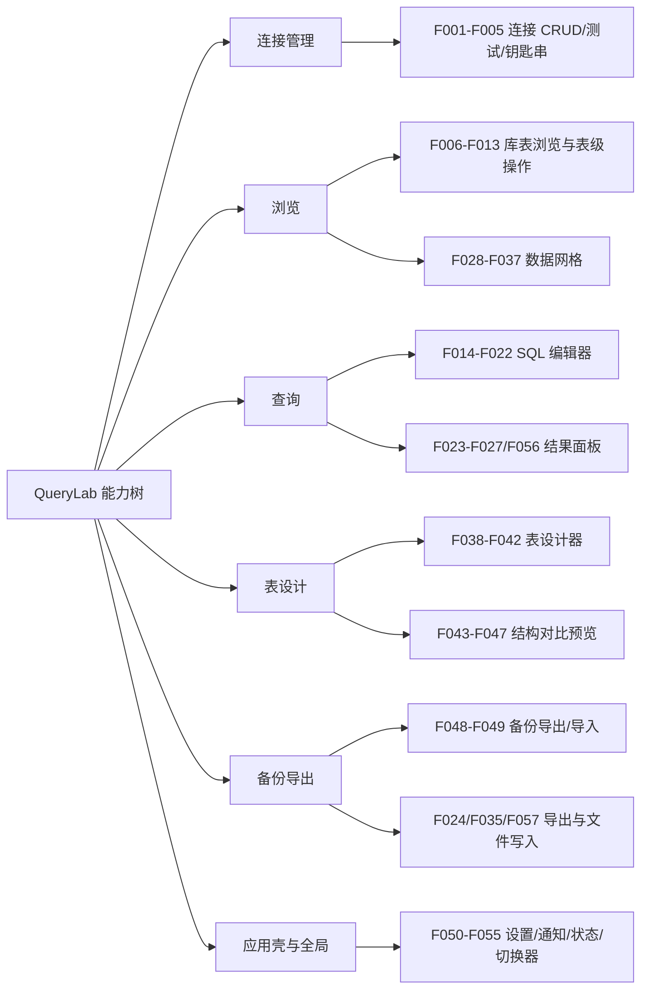

# QueryLab 产品能力树（FEATURE_MAP）

> 编制日期：2026-09-03（SOP v2.0 编号文档体系迁移时新建）
> 唯一事实来源：`docs/02_product/PRD.md`（原 `docs/product/prd.md`）§5 功能列表（F001-F057 + 2 条未编号项）。本文按能力分组重组，F 编号、状态、优先级与 PRD 完全一致；冲突时以 PRD 原文为准。

---

## 1. 能力树总览

## 2. 分组明细

### 2.1 连接管理（F001-F005，全部 P0，已实现）

| 功能ID | 名称 | 要点 |
|--------|------|------|
| F001 | 新建/编辑连接 | 5 字段表单，conn_upsert 持久化 |
| F002 | 连接列表与选择 | 点击选中并重置工作区 |
| F003 | 测试连接 | conn_test 返回延迟/版本/用户，5s 超时 |
| F004 | 删除连接 | 危险确认；删除当前连接清空工作区 |
| F005 | 密码钥匙串存储 | 密码只入系统钥匙串，connections.json 不落密码 |

> ⚠️ 已知缺陷：带密码账户「测试成功→使用失败」——凭据链路断裂（PL-01）；编辑不重输密码会清空钥匙串密码（PF-01）。详见 `docs/06_review/UX_REVIEW.md`。

### 2.2 浏览（F006-F013 库表浏览 + F028-F037 数据网格）

库表浏览（Schema 树）：

| 功能ID | 名称 | 优先级 | 状态 |
|--------|------|--------|------|
| F006 | 数据库列表（过滤 4 系统库） | P0 | 已实现 |
| F007 | 表列表（含视图，图标区分+注释） | P0 | 已实现 |
| F008 | 新建数据库（字符集/排序联动） | P1 | 已实现 |
| F009 | 新建表入口 | P0 | 已实现 |
| F010 | 右键刷新表列表 | P1 | 已实现 |
| F011 | 重命名表（视图拦截） | P1 | 已实现 |
| F012 | 清空表数据（TRUNCATE+危险确认） | P1 | 已实现 |
| F013 | 删除表（DROP+危险确认） | P1 | 已实现 |

数据网格：

| 功能ID | 名称 | 优先级 | 状态 |
|--------|------|--------|------|
| F028 | 表数据浏览（COUNT+LIMIT/OFFSET，pageSize=50） | P0 | 已实现 |
| F029 | 分页导航 | P0 | 已实现 |
| F030 | 数据筛选（列/全列 LIKE+转义） | P0 | 已实现 |
| F031 | 网格单元格编辑（UPDATE…LIMIT 1，单列主键门禁） | P1 | 已实现 |
| F032 | 新增行（排除自增列 INSERT） | P1 | 已实现 |
| F033 | 删除选中行（确认+逐行 DELETE） | P1 | 已实现 |
| F034 | 行选择（单选/全选，无主键禁用） | P1 | 已实现 |
| F035 | 网格导出（CSV/JSON/SQL INSERT） | P0 | 已实现 |
| F036 | 空表状态 | P1 | 已实现 |
| F037 | 只读降级横幅（无单列主键） | P1 | 已实现 |

### 2.3 查询（F014-F022 编辑器 + F023-F027/F056 结果面板）

SQL 编辑器：

| 功能ID | 名称 | 优先级 | 状态 |
|--------|------|--------|------|
| F014 | SQL 编辑器（CodeMirror6） | P0 | 已实现（MySQL 方言检测字段不匹配，退化 Standard SQL，PF-05） |
| F015 | 执行 SQL（Ctrl+Enter，选中优先，maxRows=1000） | P0 | 已实现 |
| F016 | 批量执行+事务 | P1 | 已实现（进度面板未接线 PF-03） |
| F017 | SQL 格式化（Ctrl+S） | P1 | 已实现 |
| F018 | SQL 代码片段（24 个，F1） | P1 | 已实现 |
| F019 | SQL 历史（会话/本地双模式，上限 100） | P1 | 已实现（搜索框无过滤 PF-07） |
| F020 | SQL 自动补全 | P1 | 部分实现（无列名、表名源未接 PF-08） |
| F021 | 编辑器内搜索 | P2 | 已实现 |
| F022 | 清空编辑器（Ctrl+K） | P2 | 已实现 |

结果面板：

| 功能ID | 名称 | 优先级 | 状态 |
|--------|------|--------|------|
| F023 | 多结果集 Tab | P0 | 已实现 |
| F024 | 结果导出 CSV/JSON | P0 | 已实现（空表名文件名缺陷 PF-04；主路径损坏 PL-02） |
| F025 | 结果单元格编辑（单表直查+单列主键门禁） | P1 | 已实现 |
| F026 | 值类型渲染（NULL/数字/字符串/bytes/主键高亮） | P1 | 已实现 |
| F027 | 结果五态 | P0 | 已实现 |
| F056 | 单元格更新命令（query_update_cell，NULL 支持） | P1 | 已实现 |

### 2.4 表设计（F038-F042 设计器 + F043-F047 结构对比）

表设计器：

| 功能ID | 名称 | 优先级 | 状态 |
|--------|------|--------|------|
| F038 | 新建表（列/主键/自增/引擎/字符集/排序/注释） | P1 | 已实现 |
| F039 | 编辑表结构（快照 diff→ALTER） | P1 | 已实现 |
| F040 | 列编辑联动（主键↔NOT NULL；自增→主键） | P1 | 已实现 |
| F041 | 结构校验（至少一列/命名规则/自增须主键/仅单列主键） | P1 | 已实现 |
| F042 | 未保存提示 | P2 | 已实现（关闭无拦截 PL-03） |

结构对比（预览）：

| 功能ID | 名称 | 优先级 | 状态 |
|--------|------|--------|------|
| F043 | 结构比较（表/列/索引差异） | P1 | 已实现（仅结构） |
| F044 | 差异列表与统计 | P1 | 已实现 |
| F045 | 差异详情面板（列级六列表+SQL 预览） | P1 | 已实现（修改列预览插值缺陷 PF-06） |
| F046 | SQL 复制/导出 | P1 | 已实现 |
| F047 | 执行结构变更（danger 确认→逐句执行→刷新） | P1 | 已实现 |

### 2.5 备份导出（F048-F049 + F024/F035/F057 导出公共件）

| 功能ID | 名称 | 优先级 | 状态 |
|--------|------|--------|------|
| F048 | 备份导出（表多选、结构+数据 SQL） | P1 | 已实现（仅 SQL；导出依赖 save() 已损坏 PL-02） |
| F049 | 备份导入（选 .sql、可选先删表） | P1 | 已实现（分句简化；文件选择不可用 PL-02/UF-06） |
| F057 | 导出文件写入（fs_write_file 自动建目录） | P1 | 已实现（无路径作用域限制 PM-01） |

### 2.6 应用壳与全局（F050-F055）

| 功能ID | 名称 | 优先级 | 状态 |
|--------|------|--------|------|
| F050 | 设置/帮助/关于面板（侧滑，轻量） | P2 | 已实现（「设置」名不副实 IA-03） |
| F051 | 全局 Toast（三级，自动消失） | P0 | 已实现 |
| F052 | 全局确认对话框（danger/info，Promise 化） | P0 | 已实现 |
| F053 | 状态栏 | P2 | 已实现 |
| F054 | 应用信息（app_get_info） | P2 | 已实现 |
| F055 | 视图切换器（5 视图条件显示） | P0 | 已实现 |

### 2.7 未编号项（PRD §5 表尾）

| 名称 | 优先级 | 状态 |
|------|--------|------|
| 批量执行进度面板（BatchProgressPanel 组件已写） | P2 | 部分实现（无入口，PF-03） |
| meta_get_schema_tree（后端命令已注册） | P2 | 未实现（前端侧零调用，C8 待确认剔除） |

## 3. 统计口径（与 PRD 一致）

- 优先级分布：P0 = F001-F006、F007、F009、F014、F015、F023、F024、F027、F028、F029、F030、F035、F051、F052、F055（16 项）；P1 = 27 项；P2 = 8 项；未编号 2 项。
- 状态分布：已实现 53、部分实现 3（F014 受限形态、F020、批量面板）、未实现 1（schema_tree 前端侧）+ 其余按 PRD 表述。
- 优先级推导依据（PRD §5 注）：旧项目 README「当前目标」与 RELEASE_CHECKLIST 主流程推导——主链路 P0，结构与数据操作辅助 P1，信息面板与增强 P2。

## 4. 关联阅读

- 页面承载（PAGE001-PAGE012 → F 编号映射）：`docs/02_product/PRD.md` §6、`docs/02_product/PAGE_SPEC.md`
- 流程视图：`docs/03_flow/USER_FLOW.md`、`docs/03_flow/PAGE_FLOW.md`、`docs/03_flow/BUSINESS_FLOW.md`
