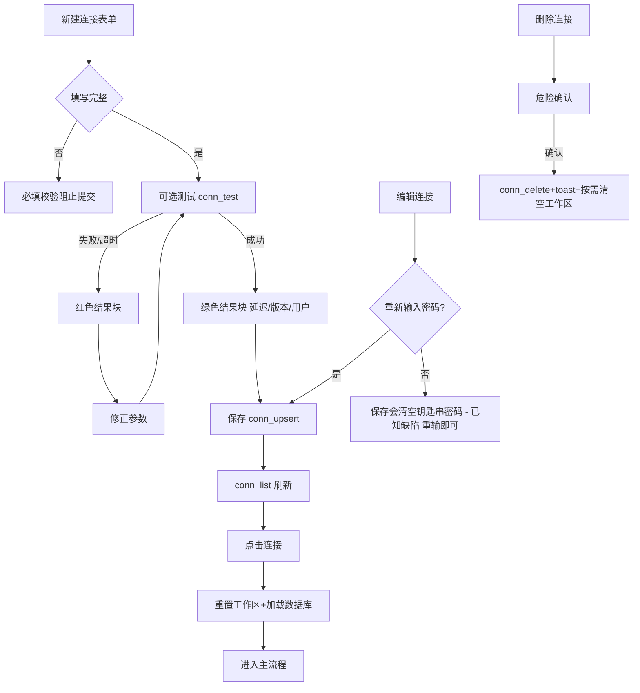
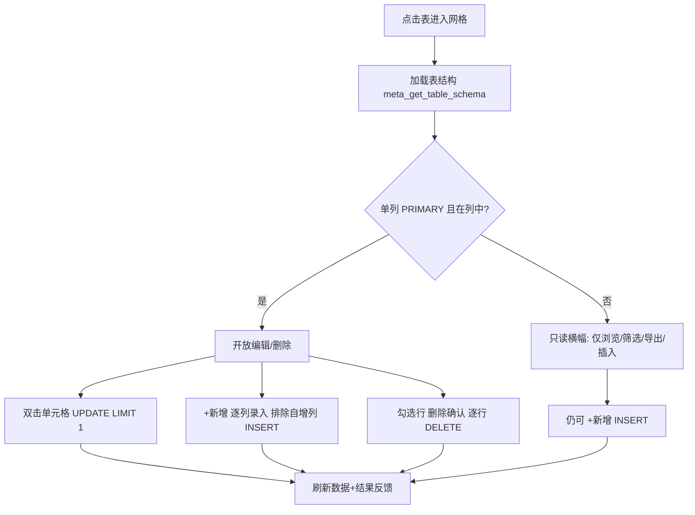
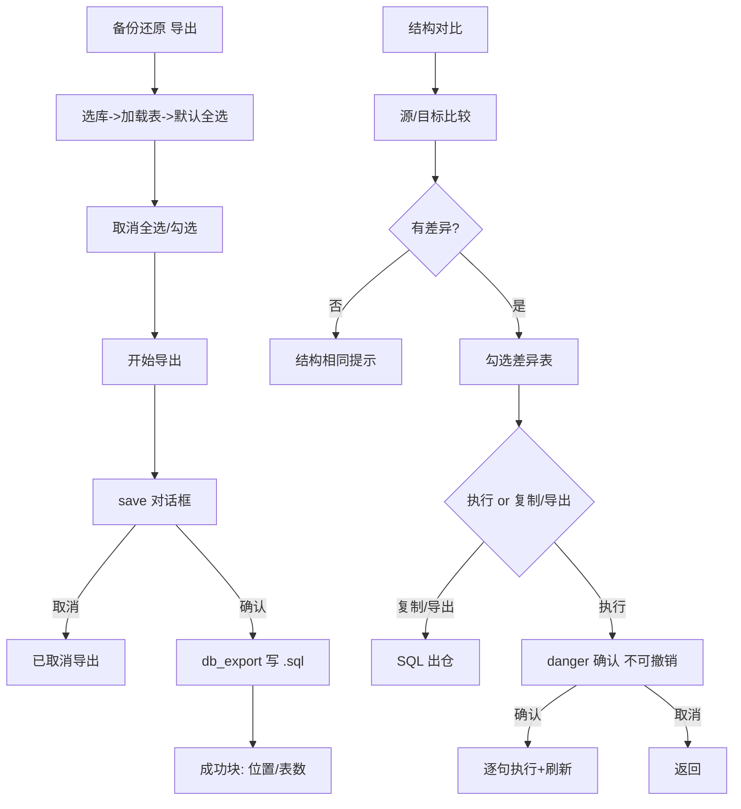

# QueryLab（lys-query-lab）产品需求文档（PRD）

> 版本：v2.0（基于旧项目逆向重制版）
> 基线：`docs/01_reverse/REVERSE_ANALYSIS.md`（旧项目事实模型）；页面编号 PAGE001-PAGE012、功能编号 F001-F057 与逆向报告完全对齐。
> 依据旧项目文档与代码：README.md、docs/PRD.md、docs/RELEASE_CHECKLIST.md、src/、src-tauri/。
> 说明：本 PRD 忠实还原旧项目已实现与已明确受限的能力，不新增商业功能，不删减既有功能。

---

## 1. 产品介绍

QueryLab 是一个**本地优先的数据库工作台桌面应用**（Tauri 2 桌面窗口，1400×900 / 最小 1000×600），首期聚焦 MySQL / MariaDB，覆盖：

- 连接管理（密码存系统钥匙串）
- Schema 浏览（库/表/视图 + 表级危险操作）
- SQL 编辑与执行（CodeMirror 6、批量+事务、片段、历史）
- 查询结果展示（多结果集、导出、受限单元格编辑）
- 数据网格（分页、筛选、行级 CRUD、CSV/JSON/SQL 导出）
- 表设计器（新建/修改表结构与表选项）
- 结构对比（预览）（结构差异分析 + 结构变更 SQL 执行）
- 备份还原（SQL 导出/导入）

产品边界（对外承诺口径，来源 docs/RELEASE_CHECKLIST.md）：
- 支持 MySQL / MariaDB；
- 「结构对比（预览）」只提供结构差异分析与结构变更 SQL 执行，不宣称真实数据同步；
- 备份/导入仅支持 SQL 格式；
- 结果面板仅对"单表直接查询 + 单列主键"开放单元格编辑；数据网格仅对单列主键表开放更新/删除。

## 2. 用户画像

| 画像 | 场景 | 关键功能 |
|------|------|----------|
| 后端开发 小张 | 本地/测试库查表改数、调试 SQL | 连接管理、SQL 编辑器、结果面板、数据网格（F001-F033） |
| 测试/QA 小李 | 验证与修正测试环境数据 | 数据网格筛选/编辑/删除、事务批量执行（F016/F028-F034） |
| 运维 老王 | 排障、导出、结构变更预演 | 备份导出导入、结构对比、表设计器（F038-F049） |
| 数据分析 小赵 | 快速查询并导出结果 | SQL 执行、结果导出 CSV/JSON、历史（F015/F023-F027） |

## 3. 使用场景

1. **首次使用**：新建连接 → 测试连接（延迟/版本/用户反馈）→ 保存 → 点击连接进入工作区。
2. **日常查询**：SQL 编辑器写 SQL（Ctrl+Enter 执行）→ 结果面板查看（多 Tab）→ 导出 CSV/JSON → 历史回溯。
3. **数据修正**：Schema 树点表 → 数据网格分页/筛选定位 → 双击编辑 / 新增行 / 勾选删除（均有确认或成功反馈）。
4. **表结构演进**：新建表（设计器）/ 修改既有表（diff 生成 ALTER）→ 保存后自动刷新 Schema。
5. **环境结构对齐**：结构对比选源/目标库 → 查看差异（表级 + 列级）→ 复制/导出 SQL 或危险确认后执行。
6. **安全底线**：备份导出 .sql → 必要时导入还原（可选先删现有表）。

## 4. 功能架构

```mermaid
flowchart LR
    subgraph 应用壳[PAGE001 应用壳]
        NAV[顶栏导航 F050] ; SWITCH[视图切换器 F055] ; STATUS[状态栏 F053]
    end
    subgraph 侧栏
        CONN[连接管理 PAGE002 F001-F005]
        SCHEMA[Schema 树 PAGE003 F006-F013]
    end
    subgraph 工作区
        QUERY[SQL 查询 PAGE004 F014-F022]
        RESULT[结果面板 PAGE005 F023-F027]
        GRID[数据网格 PAGE006 F028-F037]
        DESIGN[表设计器 PAGE007 F038-F042]
        SYNC[结构对比 PAGE008 F043-F047]
        BACKUP[备份还原 PAGE009 F048-F049]
    end
    NOTIFY[通知中心 PAGE010 F051-F052 全局]
    subgraph 后端[Tauri 命令层]
        CMD1[conn_* / app_*] ; CMD2[meta_*] ; CMD3[query_* / fs_*] ; CMD4[db_export / db_import]
    end
    应用壳 --> 侧栏 & 工作区 ; 侧栏 --> 工作区 ; 工作区 --> 后端 ; 后端 --> MySQL[(MySQL/MariaDB)]
```

## 5. 功能列表

> 状态列口径：已实现（旧项目可用）/ 部分实现（受限形态，按逆向报告⑨）/ 未实现（规划未落地）。优先级按旧项目 README「当前目标」与 RELEASE_CHECKLIST 主流程推导：主链路 P0，结构与数据操作辅助 P1，信息面板与增强 P2。

| 功能ID | 名称 | 描述 | 优先级 | 状态 |
|--------|------|------|--------|------|
| F001 | 新建/编辑连接 | 名称/主机/端口/用户/密码表单，conn_upsert 持久化 | P0 | 已实现 |
| F002 | 连接列表与选择 | 列表展示（名称+host:port），点击选中并重置工作区 | P0 | 已实现 |
| F003 | 测试连接 | conn_test，返回延迟/版本/用户，5s 超时 | P0 | 已实现 |
| F004 | 删除连接 | 危险确认后 conn_delete；删除当前连接清空工作区 | P0 | 已实现 |
| F005 | 密码钥匙串存储 | 密码只入系统钥匙串，connections.json 不落密码 | P0 | 已实现 |
| F006 | 数据库列表 | meta_list_databases，过滤 4 个系统库 | P0 | 已实现 |
| F007 | 表列表（含视图） | 展开库加载表/视图（图标区分+注释），缓存 | P0 | 已实现 |
| F008 | 新建数据库 | 库名+字符集/排序规则联动，meta_create_database | P1 | 已实现 |
| F009 | 新建表入口 | 库下"+ 新建表"进入设计器新建模式 | P0 | 已实现 |
| F010 | 右键刷新表列表 | 清缓存重载 | P1 | 已实现 |
| F011 | 重命名表 | RENAME TABLE，视图拦截提示 | P1 | 已实现 |
| F012 | 清空表数据 | TRUNCATE + 危险确认，视图拦截 | P1 | 已实现 |
| F013 | 删除表 | DROP + 危险确认（不可撤销文案） | P1 | 已实现 |
| F014 | SQL 编辑器 | CodeMirror6：行号/主题/SQL 语法/折行/搜索高亮 | P0 | 已实现（MySQL 方言检测字段不匹配，退化 Standard SQL） |
| F015 | 执行 SQL | Ctrl+Enter，选中优先，maxRows=1000，未连接报错 | P0 | 已实现 |
| F016 | 批量执行+事务 | 批量模式开关；事务包装 START TRANSACTION…COMMIT | P1 | 已实现 |
| F017 | SQL 格式化 | 关键字大写换行+缩进（Ctrl+S） | P1 | 已实现 |
| F018 | SQL 代码片段 | 24 个内置片段弹窗（F1） | P1 | 已实现 |
| F019 | SQL 历史 | 会话/本地双模式、敏感词过滤、上限 100、清空（Ctrl+H） | P1 | 已实现（搜索框无过滤） |
| F020 | SQL 自动补全 | 关键字/类型/上下文表名 | P1 | 部分实现（无列名、表名源未接） |
| F021 | 编辑器内搜索 | CodeMirror searchKeymap | P2 | 已实现 |
| F022 | 清空编辑器 | Ctrl+K / 按钮 | P2 | 已实现 |
| F023 | 多结果集 Tab | 每语句一个结果 Tab（行数标注） | P0 | 已实现 |
| F024 | 结果导出 CSV/JSON | save 对话框 + fs_write_file + 浏览器降级 | P0 | 已实现（空表名文件名缺陷） |
| F025 | 结果单元格编辑 | 单表直查+单列主键门禁，query_update_cell，NULL 开关 | P1 | 已实现 |
| F026 | 值类型渲染 | NULL/数字/字符串/bytes/主键高亮 | P1 | 已实现 |
| F027 | 结果五态 | 加载/错误/空态/成功消息/数据表 | P0 | 已实现 |
| F028 | 表数据浏览 | COUNT + LIMIT/OFFSET，pageSize=50 | P0 | 已实现 |
| F029 | 分页导航 | 上下页/页码跳转 | P0 | 已实现 |
| F030 | 数据筛选 | 列/全列 LIKE + 转义 + 清除 | P0 | 已实现 |
| F031 | 网格单元格编辑 | UPDATE…LIMIT 1，单列主键门禁 | P1 | 已实现 |
| F032 | 新增行 | 逐列录入，排除自增列 INSERT | P1 | 已实现 |
| F033 | 删除选中行 | 确认弹窗 + 逐行 DELETE | P1 | 已实现 |
| F034 | 行选择 | 单选/全选，无主键禁用 | P1 | 已实现 |
| F035 | 网格导出 | CSV / JSON / SQL INSERT | P0 | 已实现 |
| F036 | 空表状态 | 表头 + 📭 占位 | P1 | 已实现 |
| F037 | 只读降级横幅 | 无单列主键提示仅浏览/筛选/导出/插入 | P1 | 已实现 |
| F038 | 新建表 | 列/主键/自增/引擎/字符集/排序/注释 → meta_create_table | P1 | 已实现 |
| F039 | 编辑表结构 | 快照 diff → ALTER（增/删/改/重命名列/主键/表选项） | P1 | 已实现 |
| F040 | 列编辑联动 | 主键→NOT NULL；自增→主键；主键列锁定 NULL/自增可用性 | P1 | 已实现 |
| F041 | 结构校验 | 至少一列/列名规则/自增须主键/仅单列主键 | P1 | 已实现 |
| F042 | 未保存提示 | 「有未保存的更改」指示 | P2 | 已实现 |
| F043 | 结构比较 | 表/列/索引差异分析（源≠目标校验） | P1 | 已实现（仅结构） |
| F044 | 差异列表与统计 | 新增/删除/修改表、±~列、索引差异、全选 | P1 | 已实现 |
| F045 | 差异详情面板 | 列级对比六列表 + 同步 SQL 预览 | P1 | 已实现（修改列预览插值缺陷） |
| F046 | SQL 复制/导出 | 剪贴板 / 下载 .sql | P1 | 已实现 |
| F047 | 执行结构变更 | danger 确认 → 逐句执行 → 刷新 | P1 | 已实现 |
| F048 | 备份导出 | 表多选、结构+数据 SQL、进度与结果反馈 | P1 | 已实现（仅 SQL） |
| F049 | 备份导入 | 选 .sql、可选先删现有表、结果统计 | P1 | 已实现（分句简化） |
| F050 | 设置/帮助/关于面板 | 右侧滑出：安全说明/快速开始/快捷键/应用信息 | P2 | 已实现（轻量） |
| F051 | 全局 Toast | success/error/info 三级，自动消失+手动关闭 | P0 | 已实现 |
| F052 | 全局确认对话框 | danger/info tone，遮罩/Esc 取消，Promise 化 | P0 | 已实现 |
| F053 | 状态栏 | 状态消息（Ready/Connected/Executing/耗时等）+ 平台 | P2 | 已实现 |
| F054 | 应用信息 | app_get_info 版本/平台/构建（顶栏+关于） | P2 | 已实现 |
| F055 | 视图切换器 | 5 视图条件显示；切回查询自动重查当前表 | P0 | 已实现 |
| F056 | 单元格更新命令 | query_update_cell（NULL 支持） | P1 | 已实现 |
| F057 | 导出文件写入 | fs_write_file 自动建目录 | P1 | 已实现 |
| — | 批量执行进度面板 | BatchProgressPanel 组件已写，未接线 | P2 | 部分实现（无入口） |
| — | meta_get_schema_tree | 后端命令已注册，前端未用 | P2 | 未实现（前端侧） |

## 6. 页面需求

### PAGE001 主工作台（应用壳）〔F053/F054/F055/F050〕
- 目标：承载全部视图的桌面主窗口。
- 入口：应用启动。
- 展示内容：顶栏（logo/设置/帮助/关于/版本号）、侧栏（连接+Schema 两区）、视图切换器（SQL 查询；选中表后追加「数据网格」「📋 设计表」；常驻「🔍 结构对比（预览）」「💾 备份还原」）、新建表指示条、状态栏。
- 操作：切视图（切回 query 且有当前表时自动执行 `SELECT * FROM \`db\`.\`table\` LIMIT 1000;` 并回填编辑器）；打开 shell 面板。
- 响应：选中连接 → 重置工作区 + 加载数据库列表 + 状态栏「Connected to X」。
- 状态：viewMode 5 态；statusMessage 随查询生命周期变化。
- 异常：初始化失败 console.error；未连接执行 SQL → 错误「请先选择连接」+ 状态栏 No connection。

### PAGE002 连接管理〔F001-F005〕
- 目标：连接 CRUD 与测试。
- 入口：侧栏「连接」区。
- 展示内容：列表（名称、host:port、hover 显示操作按钮）、空状态、新建/编辑弹窗（5 字段）、测试结果块（绿/红）。
- 操作：新建/编辑/保存/表单内测试/列表测试/删除（全局确认）/选择连接。
- 响应：保存成功刷新列表关弹窗；测试展示延迟/版本/用户；删除成功 toast，若为当前连接则清空工作区。
- 状态：表单开合、编辑态、测试中（按钮 '...'/'测试中...'）、保存中、testResult。
- 异常：保存/测试/删除失败在结果块或 toast 展示错误文案；弹窗遮罩/Esc 可关闭。

### PAGE003 Schema 浏览树〔F006-F013〕
- 目标：库/表浏览与表级操作入口。
- 入口：侧栏「Schema」区。
- 展示内容：工具栏「+ 数据库」、库节点（展开箭头+📁+库名）、「+ 新建表」、表项（📊/👁️+名称+注释）、三种占位（请先选择连接/加载中.../无可用数据库/无表）。
- 操作：展开库、点击表（→网格）、新建表（→设计器）、新建数据库（弹窗：库名+6 字符集+联动排序规则）、右键菜单（刷新/重命名/清空/删除）及对应确认弹窗。
- 响应：DDL 成功 toast + 局部刷新；视图执行重命名/清空时提示不支持。
- 状态：expandedDbs、tablesData 缓存、contextMenu、4 个弹窗、tableOperating。
- 异常：加载失败错误文案；DDL 失败 toast「XX失败: err」；空库名报错。

### PAGE004 SQL 查询视图〔F014-F022〕
- 目标：SQL 编写执行及辅助。
- 入口：视图切换器「SQL 查询」（默认）。
- 展示内容：工具栏 8 按钮 + 连接信息 + 快捷键提示；编辑器；历史侧栏（模式切换/清空/提示条/搜索框/条目列表）；片段弹窗（24 项双列）。
- 操作：执行（Ctrl+Enter）、批量开关、事务开关、格式化、片段、历史开关与回填、清空。
- 响应：执行分流（普通/批量）；批量+事务拼事务块；历史保存含敏感过滤提示。
- 状态：batchMode/useTransaction/showHistory/showSnippetDialog/persistHistory/historyNotice/sqlHistory。
- 异常：空 SQL 忽略；未连接 notifyError；执行错误进入结果面板错误态。

### PAGE005 查询结果面板〔F023-F027/F056〕
- 目标：结果展示、导出、受限编辑。
- 入口：查询视图下半区。
- 展示内容：五态；结果 Tab（结果 N (行数)）；导出按钮（有数据时）；信息条（耗时/查询ID 前 8 位/编辑提示）；更新消息条；数据表（列名+类型、主键标记、值类型着色）。
- 操作：切 Tab、导出、双击编辑（Enter 保存 / Esc 取消 / NULL 开关）。
- 响应：编辑成功显示后端 message 并 500ms 后刷新；失败红条。
- 状态：loading/error/empty/成功消息/数据；editingCell；updateMessage；activeSetIndex。
- 异常：查询错误全文展示；门禁不满足时只读（无提示类按钮不出现）。

### PAGE006 数据网格视图〔F028-F037〕
- 目标：表数据分页浏览与 CRUD。
- 入口：Schema 点击表 / 「数据网格」Tab。
- 展示内容：工具栏（刷新/新增/删除(N)/CSV/JSON/SQL/筛选输入+列选择+筛选+清除）；消息横幅；只读横幅（无单列主键）；表格（行号/复选框/列头+类型/主键列）；空表占位；分页条。
- 操作：分页、筛选/清除、双击编辑、新增行逐列录入（Tab 跳列）、勾选/全选、删除确认、导出。
- 响应：每次写操作后刷新数据并 toast/横幅反馈；无主键时编辑删除禁用。
- 状态：data/loading/error/分页/编辑/新行/选中/筛选/确认弹窗。
- 异常：加载失败错误块；写失败错误横幅；空表显示表头+占位。

### PAGE007 表设计器〔F038-F042〕
- 目标：表结构可视化新建与修改。
- 入口：「+ 新建表」（新建模式）/「📋 设计表」（编辑模式）。
- 展示内容：头部（标题/表名输入（新建）/未保存指示/关闭/保存）、错误横幅、列表格（9 列）、表选项区（引擎 5 项/字符集 5 项/排序 7 项/表注释）。
- 操作：增删列、改属性（联动规则）、改表选项、保存、关闭。
- 响应：新建成功 toast 后端消息并刷新；编辑生成 ALTER 序列执行；无变更提示「没有需要保存的结构变更」。
- 状态：newTableName/columns/originalColumns/tableInfo/hasChanges/loading/saving/error。
- 异常：校验失败错误横幅（空列名/命名规则/自增非主键/多主键）；执行失败「保存失败: err」。

### PAGE008 结构对比（预览）〔F043-F047〕
- 目标：两库结构差异分析与结构 SQL 执行（非数据同步）。
- 入口：「🔍 结构对比（预览）」。
- 展示内容：配置区（源/目标/模式（锁定仅结构）/开始比较）、统计条 6 项、差异列表（全选+行）、详情面板（列差异表+索引提示+SQL 预览）、操作按钮 3 个、模式说明文案。
- 操作：比较、勾选、查看详情、复制 SQL、导出 SQL、执行同步（danger 确认）。
- 响应：比较完成后默认全选差异表；执行成功 toast + 通知父级刷新。
- 状态：comparing/syncResult/syncError/selectedTables/detailPanel/syncing。
- 异常：未选库/同库报错；比较失败错误块；无差异空态文案。

### PAGE009 备份还原〔F048-F049〕
- 目标：SQL 备份导出与导入。
- 入口：「💾 备份还原」。
- 展示内容：双 Tab（📤 导出备份 / 📥 导入还原）；导出：库选择/表多选网格（全选）/导出类型（结构+数据 SQL）/格式说明/开始导出+进度+结果；导入：目标库/文件选择+浏览/先删现有表复选/开始导入+进度+结果。
- 操作：切 Tab、选库加载表、勾表、导出（save 对话框）、选文件、导入。
- 响应：导出成功绿色结果块（位置/表数）+toast；导入成功结果块（表数/行数）。
- 状态：importMode/isExporting/进度/结果/isImporting。
- 异常：取消保存提示「已取消导出」；失败红色结果块+toast。

### PAGE010 通知中心〔F051-F052〕
- 目标：全局反馈与危险操作拦截。
- 入口：全局挂载；业务触发。
- 展示内容：右上 Toast 栈（三级配色）；确认对话框（标题/正文/双按钮）。
- 操作：关闭 Toast；确认/取消（遮罩/Esc 均取消）。
- 响应：Toast 3.2s（error 4.5s）自动消失；确认 Promise resolve。
- 状态：toastStore/confirmStore。
- 异常：并发确认时旧确认自动 resolve(false)。

### PAGE011 设置/帮助/关于〔F050〕
- 目标：轻量信息面板。
- 入口：顶栏三按钮。
- 展示内容：设置（安全与存储/当前限制）、帮助（快速开始 4 步/能力边界/快捷键 5 条）、关于（版本/平台/构建/定位/发布阶段）。
- 操作：关闭（×/遮罩/Esc）。
- 状态：shellPanel ∈ {settings, help, about, null}。

### PAGE012 批量执行进度面板（未接线）
- 目标：批量语句逐条进度。入口：【未知】（旧项目未接线）。
- 展示内容：进度条、总计/成功/失败、语句列表（类型图标+状态）、错误详情。
- 状态：部分实现（组件存在无调用方）；重制版按评审需要保留为演示态，不承诺入口。

## 7. 业务流程（Mermaid）

### 7.1 连接生命周期

### 7.2 数据网格 CRUD 门禁

### 7.3 备份与结构变更

## 8. 验收标准（Given-When-Then，按功能ID）

> 每条可在 HTML 原型（P1-P3 旧版原型现位于 prototype/v0-old/app-prototype.html；P6 V1 新版原型见 prototype/v1-new/app-prototype.html）场景库或旧项目复现。

- F001 Given 新建连接表单打开，When 填写名称/主机/端口/用户并保存，Then 连接出现在列表。
- F001（编辑回填）Given 已存在连接，When 点 ✎，Then 表单回填除密码外字段（密码不回传）。
- F002 Given 已有连接列表，When 点击某连接，Then 该项高亮（左侧蓝条）、状态栏显示 Connected to X、Schema 区加载数据库。
- F003 Given 表单或列表，When 点击测试，Then 成功显示绿色块（延迟/版本/用户）或失败红色块（连接失败/超时文案）。
- F004 Given 任一连接，When 点 ✕ 并确认，Then 连接消失并 toast「连接已删除」；当且仅当删除当前连接时工作区清空。
- F005 Given 保存的连接，When 查看后端 connections.json，Then 不含密码字段（密码在钥匙串）。
- F006 Given 已连接，When Schema 区加载，Then 数据库列表不含 information_schema/mysql/performance_schema/sys。
- F007 Given 展开某库，When 表加载完成，Then 表与视图图标区分（📊/👁️）并显示注释 tooltip。
- F008 Given 点「+ 数据库」，When 输入库名选择字符集，Then 排序规则列表联动；创建成功 toast 并自动展开新库。
- F009 Given 展开的库，When 点「+ 新建表」，Then 进入设计器新建模式并显示「📝 新建表: {db}」指示条。
- F011/F012/F013 Given 表右键，When 选重命名/清空/删除，Then 出现对应弹窗；删除与清空带「不可撤销」红色警告；对视图执行重命名/清空提示不支持；确认后 toast 成功并刷新。
- F014 Given 查询视图，When 输入 SQL，Then 编辑器显示行号、深色主题、SQL 着色。
- F015 Given 已连接且编辑器有 SQL，When Ctrl+Enter（或选中部分后执行），Then 优先执行选中 SQL；结果面板显示数据（原型：结果五态场景）。
- F015（未连接）Given 未选连接，When 执行，Then toast「请先选择连接」且状态栏 No connection。
- F016 Given 开启批量模式，When 执行多语句，Then 整段提交并状态栏显示「Batch completed: N statements, Xms」；开启事务时语句被 START TRANSACTION/COMMIT 包裹。
- F017 When 点格式化/Ctrl+S，Then SQL 关键字大写并按子句换行缩进。
- F018 When 打开片段弹窗（F1），Then 列出 24 个片段；点击插入编辑器光标处。
- F019 When 执行 SQL，Then 历史新增该条（去重置顶）；含 password/token 等敏感词时提示「仅保留当前会话」不落本地。
- F020 Given 输入 sel 前缀，When 触发补全，Then 出现关键字候选；FROM/JOIN 后优先表名（原型以说明标注受限）。
- F022 When Ctrl+K/清空，Then 编辑器内容清空。
- F023 Given 多语句查询，When 完成，Then 每语句一个结果 Tab 且标注行数；点击可切换。
- F024 Given 有数据结果，When 点 CSV/JSON，Then 弹保存对话框，确认后写文件并提示；取消则不报错。
- F025 Given 单表直查（`SELECT * FROM \`db\`.\`t\` [LIMIT n]`）且表有单列主键，When 双击非主键单元格，Then 出现编辑器（✓/✗/NULL）；保存显示后端消息并自动刷新；复杂 SQL 结果只读。
- F027 Given 查询生命周期，When 加载/失败/空/DDL/数据，Then 分别显示执行中 spinner / ⚠️ 错误详情 / 空态文案 / 「执行成功，影响 N 行」/ 数据表。
- F028/F029 Given 打开有 120 行数据的表，When 翻页，Then 每页 50 行，分页条显示「第 X / 3 页，共 120 行」，跳页合法。
- F030 Given 筛选输入+指定列，When 点筛选，Then 仅该列 LIKE 过滤且计数同步；点清除恢复。
- F031 Given 单列主键表，When 双击编辑保存，Then 执行 UPDATE…LIMIT 1 并刷新反馈「更新成功」；无单列主键表双击提示不支持。
- F032 Given 点「+ 新增」，When 逐列填写并在最后一列保存，Then 自增主键列被排除 INSERT，反馈「插入成功」。
- F033 Given 勾选 N 行，When 点删除并确认，Then 逐行删除反馈「成功删除 N 行」；取消则不动。
- F035 Given 网格工具栏，When 点 SQL 导出，Then 生成 INSERT 语句文件。
- F036 Given 空表，When 打开网格，Then 显示列头与「📭 此表当前没有数据」。
- F037 Given 无单列主键表，When 打开网格，Then 顶部横幅提示只读边界。
- F038 Given 新建模式填表名+列，When 保存，Then meta_create_table 成功 toast「表 '{db}.{table}' 创建成功」并刷新切换网格。
- F039 Given 编辑模式修改列类型/列名/主键/表选项，When 保存，Then 生成并执行对应 ALTER（CHANGE COLUMN/MODIFY/DROP/ADD/表选项）；无变更提示无变更。
- F041 Given 0 列或非法列名或双主键或自增非主键，When 保存，Then 错误横幅阻止提交（文案见逆向报告④）。
- F042 Given 任一修改，Then 头部出现「有未保存的更改」。
- F043 Given 源=目标，When 比较，Then 报错「源数据库和目标数据库不能相同」；合法输入后输出统计与差异列表。
- F045 Given 有列差异的表，When 点击行，Then 详情面板显示列级对比表与 SQL 预览。
- F047 Given 已勾选差异，When 执行同步并确认，Then 逐句执行并 toast「结构变更已执行完成」；取消不执行。
- F048 Given 导出页选库选表，When 开始导出并确认路径，Then 生成 .sql 并显示成功块（位置/表数）；取消路径提示「已取消导出」。
- F049 Given 导入页选库+文件，When 开始导入，Then 结果块显示导入表数/行数。
- F050 When 点设置/帮助/关于，Then 右侧滑出对应面板，内容与旧项目一致（安全说明/快捷键/版本信息）。
- F051/F052 When 触发通知/确认，Then Toast 3 级配色自动消失；确认遮罩/Esc 视为取消。
- F053 Given 查询完成，Then 状态栏显示「Query completed in Xms」与平台。
- F055 Given 选中表后在网格/设计间切换，When 回到「SQL 查询」，Then 自动执行 `SELECT * FROM \`db\`.\`table\` LIMIT 1000;` 并回填编辑器。

## 9. 非功能性需求（源自旧项目既定事实）

- 桌面窗口：1400×900 默认、1000×600 最小、可缩放（tauri.conf.json）。
- 安全：连接密码仅存钥匙串；SQL 历史默认会话级、敏感词不落盘；危险操作（删连接/删表/清空/网格删行/结构变更/导入删表）必须二次确认。
- 性能：查询 maxRows=1000 截断；网格分页 50 行；备份每表数据上限 10000 行；连接测试 5 秒超时。
- 本地优先：无网络依赖；数据文件均在本地（connections.json、钥匙串、localStorage）。
