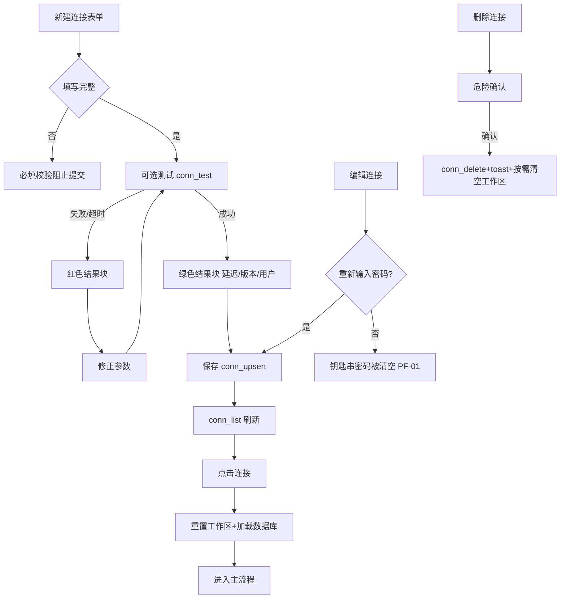
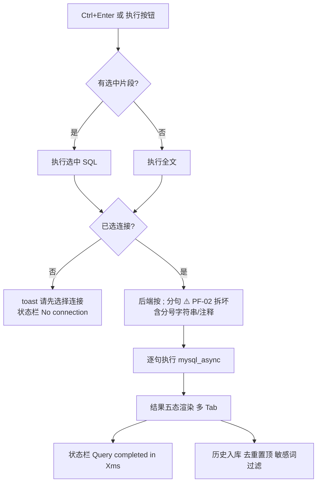
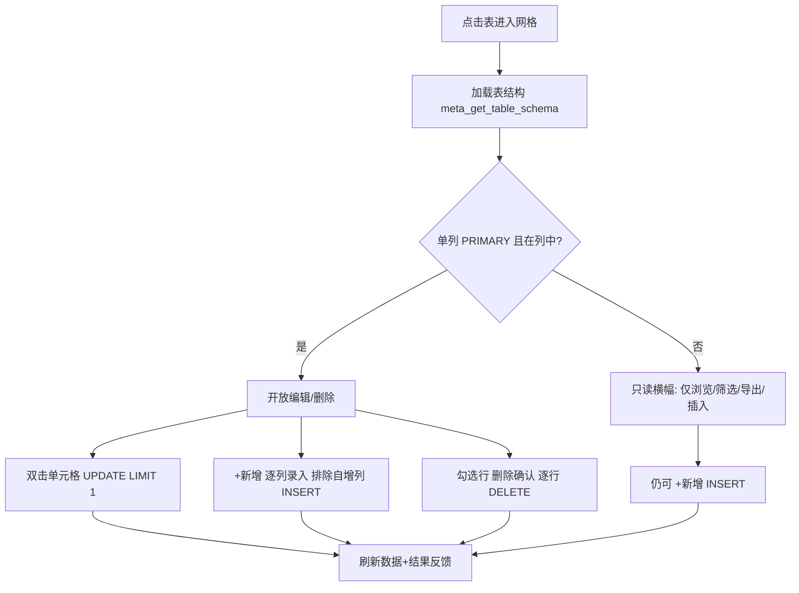
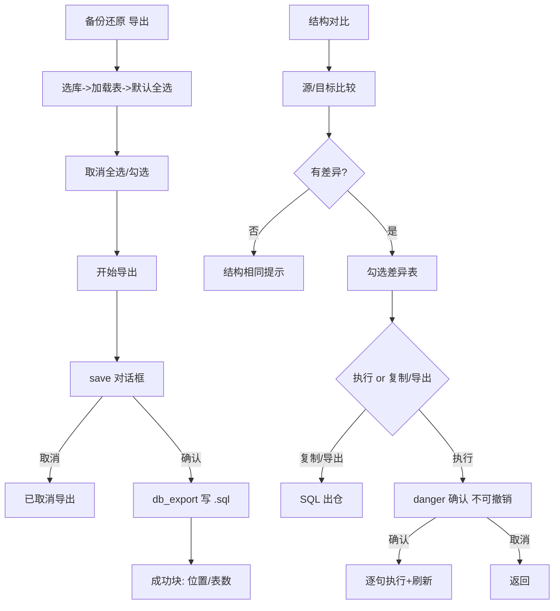
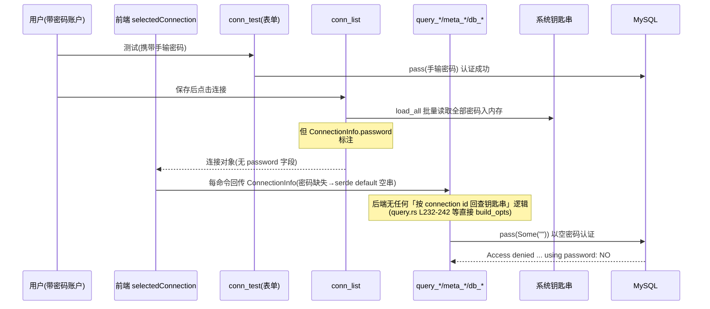

# QueryLab 业务流程（BUSINESS_FLOW）

> 编制日期：2026-09-03（SOP v2.0 编号文档体系迁移时新建）
> 事实来源：`docs/02_product/PRD.md` §7 业务流程（Mermaid 原图）、`docs/product-review/USER_FLOW_REVIEW.md` §三异常分支专项、`docs/product-review/PRODUCT_LOGIC_REVIEW.md`（PL-01 凭据链路断裂）、`docs/product-review/DATA_STORAGE_REVIEW.md`。本文按「正常 / 异常 / 边界」三口径整理，已知缺陷均标注编号，未实测处标【未知】。

---

## 1. 连接生命周期（正常流）

（图源：PRD §7.1 原图，微调）

## 2. 查询执行（正常流，源 PRD §3 场景 2 + SYSTEM_ARCH §3.1）

## 3. 数据网格 CRUD 门禁（正常+边界，源 PRD §7.2 原图）

边界口径（源 PRD §1/RELEASE_CHECKLIST）：结果面板编辑需「单表直查 + 单列主键 + 主键列在结果列中」；主键列本身不可编辑；复杂 SQL 结果只读。

## 4. 备份与结构变更（正常流，源 PRD §7.3 原图）

## 5. 异常分支专项（源 USER_FLOW_REVIEW §三，2026-09-03 评审）

| 异常场景 | 现有提示 | 下一步指引 | 可恢复性 | 评审编号 |
|----------|----------|-----------|----------|----------|
| 测试连接失败（表单态） | 红块「连接失败: err / 连接超时（5秒）」 | 无直达编辑 | 改参数重测 | P4 FL-01（B） |
| 测试连接失败（列表态 ⚡） | 红块同上 | 无；带密码账户此测试恒失败（传参无密码） | 重输密码（进编辑表单） | UF-01 |
| 选中连接后加载库失败 | console.error **仅静默**（App.svelte L47-49）；Schema 区「无可用数据库」 | 无 | 重连/重启 | UF-07：静默失败 |
| 查询中连接失败/断连 | ResultsPanel 错误态「连接失败: err」+状态栏 Query failed | 无「去编辑/去重连」直达 | 手动重试 | UF-07 合并 |
| 查询超时 | **无任何超时机制**（query_execute 无 timeout，前端无 abort；conn_test 有 5s 形成不一致） | 无 | 等待或重启应用 | UF-02：流程无终点 |
| 数据库权限拒绝 | MySQL 报错原文透传 | 无解释性包装 | 换连接/账号 | UF-07 合并 |
| 无单列主键编辑拒绝 | 网格：只读横幅+按钮禁用+双击提示；结果面板：静默只读 | 网格侧有解释 | 用 SQL 改 | P4 PP-02 |
| 导出写文件失败 | 降级下载（无 toast 区分主/降级路径） | 无 | 依赖 webview 行为 | UF-03 |
| 导入文件选择失败 | **console.error 静默**（DatabaseBackup L219-220）；按钮禁用无原因 | 无 | 无 | UF-06 |
| 批量事务失败 | 「Batch execution failed」；无显式 ROLLBACK（靠连接关闭隐式回滚，回滚语义【未知——需实测】） | 无 | — | UF-04 |

## 6. 已知缺陷：凭据链路断裂（PL-01，B 级，本次评审最高优先级）

> 源：`docs/product-review/PRODUCT_LOGIC_REVIEW.md` §四 PL-01 详述（代码路径核实，未实测）。

- 要点：钥匙串「存而不取」——`get_connection_password` 全仓唯一调用点在 `load_all`（connections.rs L52），读到的密码只服务于随后被 skip_serializing 丢弃的序列化；执行链路 9 个命令（query/meta/db 全家族）从不读钥匙串。
- 影响：带密码账户「测试成功→使用失败」，核心承诺不可用；P4 PF-01 的「重输密码即可恢复」结论在代码层面不成立。
- 掩盖原因：src-ui 旧副本表单预填 'root123456'；历史验证仅确认「进入运行态」。
- 建议方向：凭据解析下沉服务端（命令改收 connection_id，执行时取钥匙串密码）。

## 7. 已知缺陷：对话框链路断裂（PL-02，B 级）对业务流的影响

- 导出流（F024/F035/F048）：save() 必然 reject → 静默降级浏览器下载（落点不可控，无 toast 区分 UF-03）。
- 导入流（F049）：open() 必然 reject 且无降级 → importFile 恒空 → 「开始导入」永久禁用（UF-06）——业务流第一步即断。

## 8. 边界与约束口径汇总（源 PRD §9 非功能性需求）

- 查询 maxRows=1000 截断；网格分页 50 行；备份每表数据上限 10000 行；连接测试 5 秒超时。
- 密码仅存钥匙串；SQL 历史默认会话级、敏感词（password/token 等）不落盘（仅关键词过滤，数据字面量不设防——DS-03）。
- 危险操作六类必须二次确认：删连接/删表/清空/网格删行/结构变更/导入删表（编辑器直接执行 DROP/TRUNCATE 无确认——PL-04 确认策略不对称）。
- 系统库过滤：information_schema/mysql/performance_schema/sys 隐藏。

## 9. 关联阅读

- 用户旅程视图：`docs/03_flow/USER_FLOW.md`
- 时序图（5 张）：`docs/05_sequence/SEQUENCE_DIAGRAMS.md`
- 数据流动与存储：`docs/04_architecture/DATA_FLOW.md`
