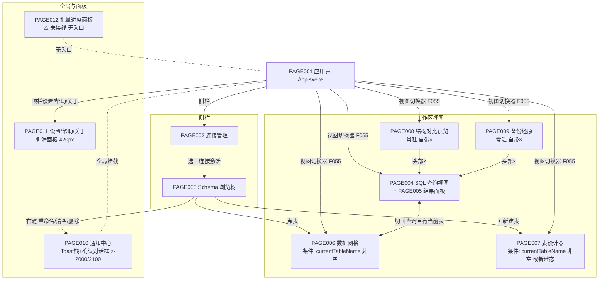

# QueryLab 页面跳转关系（PAGE_FLOW）

> 编制日期：2026-09-03（SOP v2.0 编号文档体系迁移时新建）
> 事实来源：`docs/02_product/PAGE_SPEC.md`（原 `docs/product/page-spec.md`）§二「跳转关系」列、`docs/product-review/INFORMATION_ARCHITECTURE_REVIEW.md` §一导航层级图（据源码实测绘制）、`src/App.svelte`。本项目为单窗口桌面应用，「页面」= 应用壳内视图 + 弹层/面板；无路由/无面包屑，全部状态驱动切换。

---

## 1. 页面跳转总图

- 视图渲染条件（App.svelte L342）：`viewMode==='query' || (!currentTableName && !isCreatingNewTable)`——query 态隐式兜底（STATE_REVIEW ST-02）。
- 导航触发方式统计（IA_REVIEW）：视图切换器按钮 5、侧栏树点击 2、右键菜单 1、顶栏 3。

## 2. 出入口表（每页入口/出口，源 PAGE_SPEC §二「进入条件/跳转关系」）

| 页面 | 入口 | 出口 | 备注 |
|------|------|------|------|
| PAGE001 应用壳 | 应用启动（无前置） | —（承载全部） | viewMode 5 态：query/grid/design/sync/backup |
| PAGE002 连接管理 | 侧栏「连接」区 | 选中连接 → 激活 PAGE003；✎/⚡/✕ → 表单弹窗/测试/确认 | 删除当前连接联动清空工作区（正面） |
| PAGE003 Schema 树 | 需已选连接 | 点表 → PAGE006；+ 新建表 → PAGE007（新建模式）；右键 → 刷新/重命名/清空/删除弹窗 | 新建表按钮在库节点展开区内部（UF-08） |
| PAGE004 SQL 查询 | 视图切换器「SQL 查询」（默认） | 执行 → PAGE005 结果；历史/片段弹窗 | 从 grid/design 切回时自动重查当前表并回填编辑器 |
| PAGE005 结果面板 | PAGE004 下半区（查询完成） | 导出（save 对话框→降级下载）；单元格编辑 | 非独立导航单元 |
| PAGE006 数据网格 | Schema 点表；视图切换器「数据网格」（条件按钮） | 视图切换器 → 其他视图 | 无×关闭钮 |
| PAGE007 表设计器 | 「+ 新建表」（新建）/「📋 设计表」（编辑，条件按钮） | 保存成功 → 切网格；关闭 → 回网格 | ⚠️ 右键菜单无「设计表」入口（IA-01）；关闭无确认（PL-03） |
| PAGE008 结构对比 | 视图切换器「🔍 结构对比（预览）」（常驻） | 头部× → 回查询；或点「SQL 查询」 | 双关闭路径冗余（IA-02） |
| PAGE009 备份还原 | 视图切换器「💾 备份还原」（常驻） | 头部× → 回查询 | 同上 |
| PAGE010 通知中心 | 全局挂载，业务触发 | 确认/取消、Toast 自动消失 | z-2000/2100；并发确认旧确认自动 resolve(false) |
| PAGE011 设置/帮助/关于 | 顶栏三按钮 | ×/遮罩/Esc 关闭 | shellPanel ∈ {settings, help, about, null}；「设置」仅静态说明（IA-03） |
| PAGE012 批量进度面板 | 【未知】（旧项目未接线，无入口） | 【未知】 | 组件完整但无调用方（PF-03/IA-07） |

## 3. 关闭语义一致性（源 IA_REVIEW §三抽查⑥）

- 工作视图（query/grid/design）：无×，仅靠视图切换器。
- 工具视图（sync/backup）：自带头部×（dispatch close → setViewMode('query')），与切换器并存且效果相同——同类对象两种关闭模型（IA-02，B 级）。

## 4. 多数据库类型下的功能归属预留（源 IA_REVIEW §四）

当前 MySQL-only；`driver.rs` Driver/Capabilities trait 与 `ConnectionInfo.driver` 字段为空壳预置（连接表单隐藏固定 'mysql'）。扩库时需在连接表单（驱动选择/端口默认值/方言参数区）、meta 命令（information_schema → pg_catalog/sqlite_master 分派）、设计器（引擎/字符集选项按 driver 能力隐藏）补归属位（IA-05/PL-05）。

## 5. 关联阅读

- 页面 11 维度规格：`docs/02_product/PAGE_SPEC.md`
- 信息架构评审全文：`docs/product-review/INFORMATION_ARCHITECTURE_REVIEW.md`；摘编：`docs/06_review/IA_REVIEW.md`
- 状态机：`docs/04_architecture/STATE_MACHINE.md`
