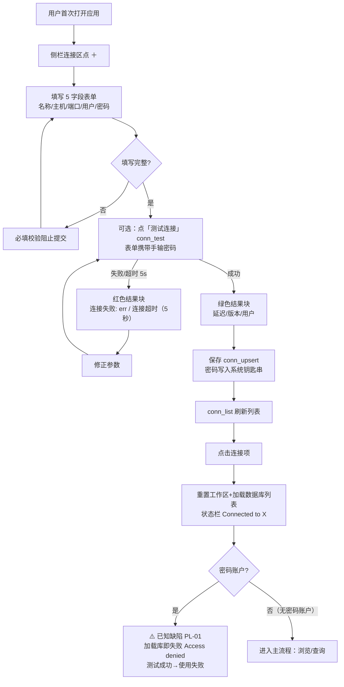
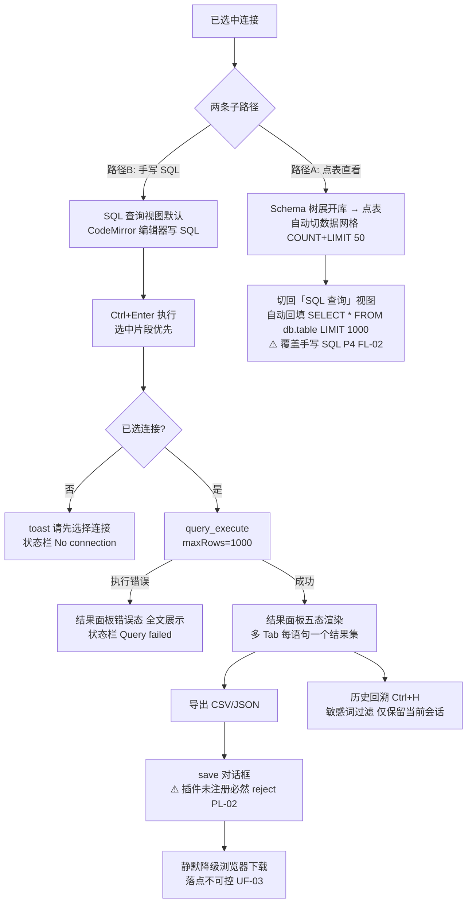
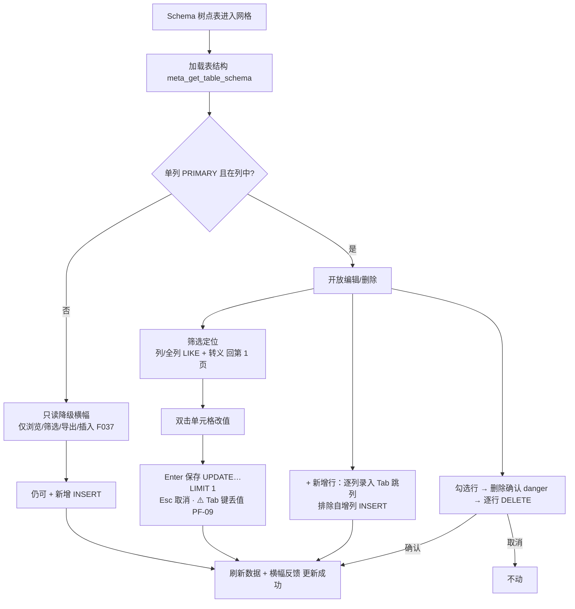
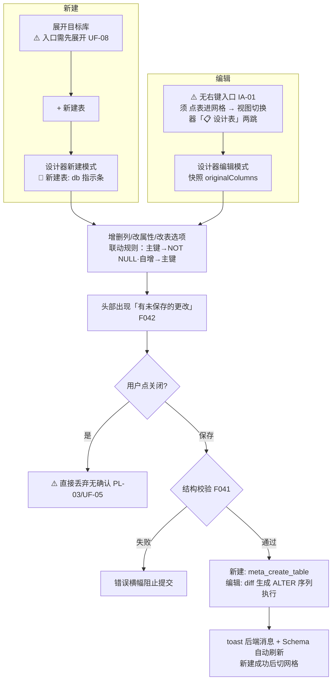
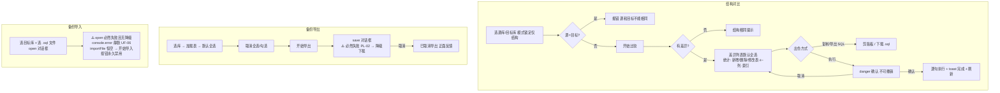
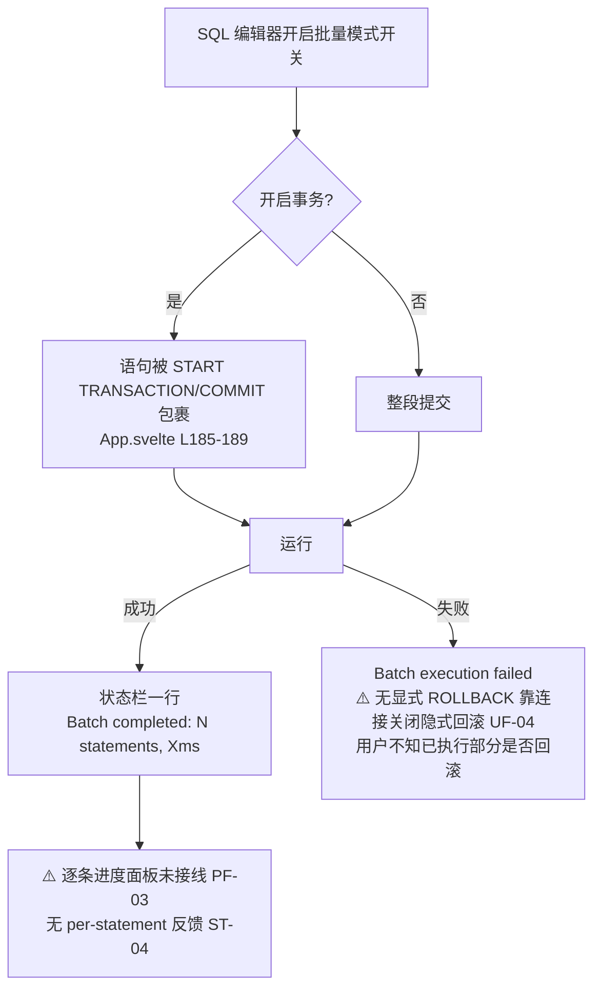

# QueryLab 用户旅程（USER_FLOW）

> 编制日期：2026-09-03（SOP v2.0 编号文档体系迁移时新建）
> 事实来源：`docs/02_product/PRD.md` §3/§7/§8（场景/流程/验收）、`docs/product-review/USER_FLOW_REVIEW.md`（F1-F8 路径对比与异常分支，2026-09-03 评审实测口径）、`src/App.svelte`、`src/components/*.svelte`。评审已标注：无 MySQL 实例，连接类行为以源码逻辑推断（涉及处注明）。

---

## 旅程一：首次连接建立（对应评审 F1 + PRD 场景 1）

- 路径形态评审结论（USER_FLOW_REVIEW F1）：路径**符合**最快合理路径（2-3 步）；但带密码账户在「点连接项」后加载库即失败（UF-01，代码路径核实未实测）。
- 异常出口：测试失败红块（无直达编辑，P4 FL-01 已列 B）；保存失败 toast。

## 旅程二：日常查询闭环（对应评审 F2/F3 + PRD 场景 2）

- 评审结论（F2）：路径骨架**符合**；两处断点：UF-01 凭据、自动回填覆盖手写 SQL。
- 评审结论（F3 导出）：**不符合**——主路径（原生对话框）不存在，实际永远走降级；文件名在非单表查询时为 `_export.csv`（PF-04）。
- 异常出口缺口：SQL 执行无超时无取消，「执行中」态可能无终点（UF-02）。

## 旅程三：数据修正（对应评审 F4 + PRD 场景 3）

- 评审结论（F4）：路径**符合**最快合理路径（3 步）；无单列主键表的只读降级有横幅提示（正面）。

## 旅程四：表结构演进（对应评审 F5 + PRD 场景 4）

- 评审结论（F5）：新建**符合**；编辑路径多一跳且意图错位（IA-01）；关闭无异常出口（PL-03）。

## 旅程五：备份与结构对齐（对应评审 F6/F7 + PRD 场景 5/6）

- 评审结论（F6 结构对比）：路径**符合**，危险确认与完成刷新齐备（正面）；「新增表仅注释」为承诺边界。
- 评审结论（F7 备份）：**不符合**——导入流程在打包态第一步就走不通（UF-06）；导出取消路径反馈「已取消导出」是正面细节。

## 旅程六：批量执行含事务（对应评审 F8）

- 评审结论（F8）：**部分符合**——执行可用，反馈层缺位；事务失败无 ROLLBACK 感知（mysql_async 连接 drop 回滚语义【未知——需实测】）。

## 附：旅程健康度总表（源 USER_FLOW_REVIEW §二）

| 旅程 | 五要素完整性 | 主要缺口 |
|------|--------------|----------|
| F1 连接 | 触发/前置/步骤/结果清晰 | 带密码账户「测试成功→使用失败」无解释（UF-01） |
| F2 主查询 | 清晰 | 执行无超时无取消（UF-02）；自动回填覆盖手写 SQL |
| F3 导出 | 设计上清晰 | 主路径损坏（UF-03=PL-02）；降级落点不可控 |
| F4 网格修正 | 清晰 | Tab 丢值（PF-09） |
| F5 结构演进 | 清晰 | 关闭丢弃未保存无确认（UF-05=PL-03）；编辑两跳（IA-01） |
| F6 结构对比 | 清晰 | 基本完备（正面） |
| F7 备份 | 设计上清晰 | 导入文件选择不可用（UF-06=PL-02） |
| F8 批量 | 清晰 | 无逐条进度（PF-03）；事务失败无 ROLLBACK 感知（UF-04） |
