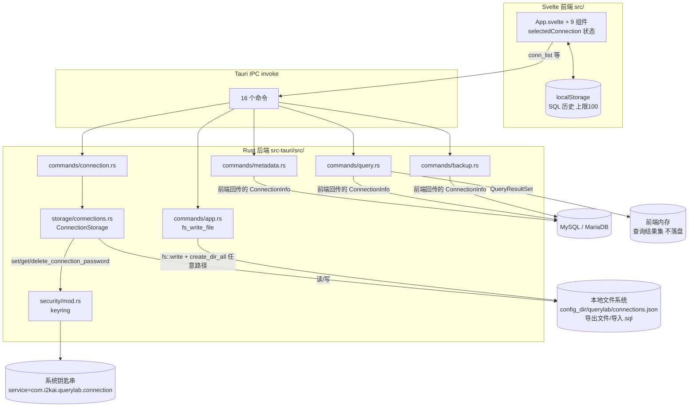
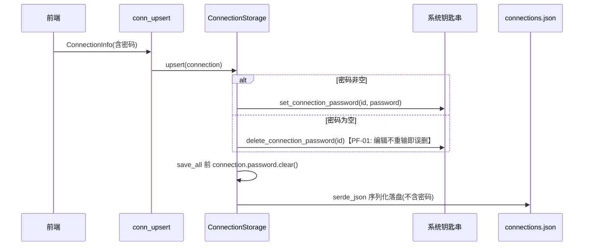
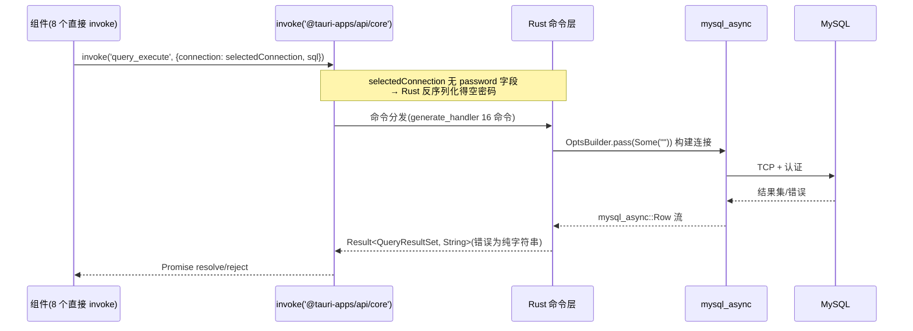

# QueryLab 数据流动（DATA_FLOW）

> 编制日期：2026-09-03（SOP v2.0 编号文档体系迁移时新建）
> 事实来源：`src-tauri/src/storage/connections.rs`、`src-tauri/src/security/mod.rs`、`src-tauri/src/db/driver.rs`、`src-tauri/src/commands/*.rs`、`src/App.svelte`、`docs/04_architecture/SYSTEM_ARCH.md`（原 tech-architecture.md）§2-§3、`docs/product-review/DATA_STORAGE_REVIEW.md`、`docs/product-review/PRODUCT_LOGIC_REVIEW.md` PL-01。现状与目标态分列；未实测处标【未知】。

---

## 1. 现状数据流总图

## 2. 连接配置 → keychain 链路（含密码 skip_serializing 事实）

### 2.1 保存链路（正常）

### 2.2 密码「skip_serializing」链路事实（PL-01 核心）

- 序列化跳过：`src-tauri/src/db/driver.rs` L64-65，`pub password: String` 标注 `#[serde(default, skip_serializing)]`——密码**不进任何 JSON**（磁盘文件与 IPC 返回均无）；`default` 使反序列化缺字段时得空串。
- 双保险落盘：`storage/connections.rs` `save_all`（L60-67）落盘前逐条 `connection.password.clear()`；Rust 单测 `save_all_does_not_persist_password_field`（L127-150）锁定「文件不含密码」行为（PERMISSION_REVIEW PM-06 正面项）。
- 唯一读取点：`get_connection_password` 全仓唯一调用在 `load_all`（connections.rs L51-53）——每次 conn_list/upsert/delete 都**批量把全部连接密码读入内存**（PM-04 时机过宽），读到的密码只存在于内存对象，随后被 skip_serializing 丢弃，**从不抵达执行链路**。
- 执行链路取值：`query_execute`/`meta_*`/`db_*` 等 9 个命令直接用**前端回传的 ConnectionInfo** 构建连接（`query.rs` L232-242 `build_opts`、`metadata.rs` L431-441、`backup.rs` L348），无任何按 id 回查钥匙串逻辑 → 前端 `selectedConnection` 来自 `conn_list`（无 password 字段）→ serde default 空串 → `pass(Some(""))` 空密码认证 → 带密码账户必失败。
- 明文迁移：`load_all`（L37-49）发现遗留明文密码时自动迁移入钥匙串后重写文件（向后兼容正面设计）。

### 2.3 目标态（修正方向，源 PL-01 建议与 SYSTEM_ARCH §3.2）

- 命令契约改为接收 `connection_id`；后端执行时按 id 单条读取钥匙串密码，即用即弃；load_all 不再回填密码。
- 密码不落盘属性保持（PM-06 不动）。

## 3. 前端命令 → Rust → 数据库链路

### 3.1 现状

- 每命令新建连接（无连接池/无会话复用）【依据：commands 内 Conn::new 后即用即断，无全局状态】；`conn_test` 有 5s 超时（tokio::time::timeout），`query_execute` 无超时（UF-02）。
- 元数据访问硬编码 `information_schema`（metadata.rs SCHEMATA/TABLES/COLUMNS/STATISTICS），MySQL-only。

### 3.2 目标态（源 SYSTEM_ARCH §2-§3）

- 新增 `src/lib/api/` 统一 invoke 层（现状 8 个组件各自 invoke，invoke 调用共 30+ 处）；统一错误文案映射与超时。
- 凭据解析下沉服务端（见 §2.3）；SQL 分句算法收敛前端 `sqlUtils`（后端只接收语句数组，修正 PF-02 按 `;` 裸拆）。

## 4. 数据存储分布（源 DATA_STORAGE_REVIEW §一/§二）

| 数据 | 介质 | 写入方 | 读取方 | 生命周期备注 |
|------|------|--------|--------|--------------|
| 连接配置（无密码） | `config_dir/querylab/connections.json` | conn_upsert/conn_delete（save_all） | 每次 load_all | 无迁移/备份能力；含内网拓扑明文（DS-04） |
| 连连接密码 | 系统钥匙串（按 id 分条） | upsert/load_all 迁移 | 仅 load_all（存而不取，DS-01） | 删除连接时同步删；孤儿条目无清理（DS-09） |
| SQL 历史 | localStorage（会话默认/本地可选） | SqlEditor 执行后 | 历史面板 | 上限 100；敏感词过滤仅关键词（DS-03）；跨连接混存（DS-05） |
| 查询结果 | 前端内存 | query_execute 返回 | ResultsPanel/DataGrid | 仅内存不落盘（DS-07 正面） |
| 导出文件 | 本地文件系统（fs_write_file 任意路径） | 导出链路 3 组件 | 用户 | 自动建目录（PM-01 无作用域限制） |
| 备份 .sql | 本地文件系统 | db_export（含全量明文数据，DS-08 观察） | db_import（任意路径读，PM-02） | 用户保管 |
| 日志/诊断 | **无** | — | — | DS-06/PL-06：排障信息仅 console |

## 5. 关联阅读

- 分层架构与目标态：`docs/04_architecture/SYSTEM_ARCH.md`
- 数据模型字段级契约：`docs/08_development/DATA_MODEL.md`
- 五张时序图：`docs/05_sequence/SEQUENCE_DIAGRAMS.md`
- 数据存储评审全文：`docs/product-review/DATA_STORAGE_REVIEW.md`
