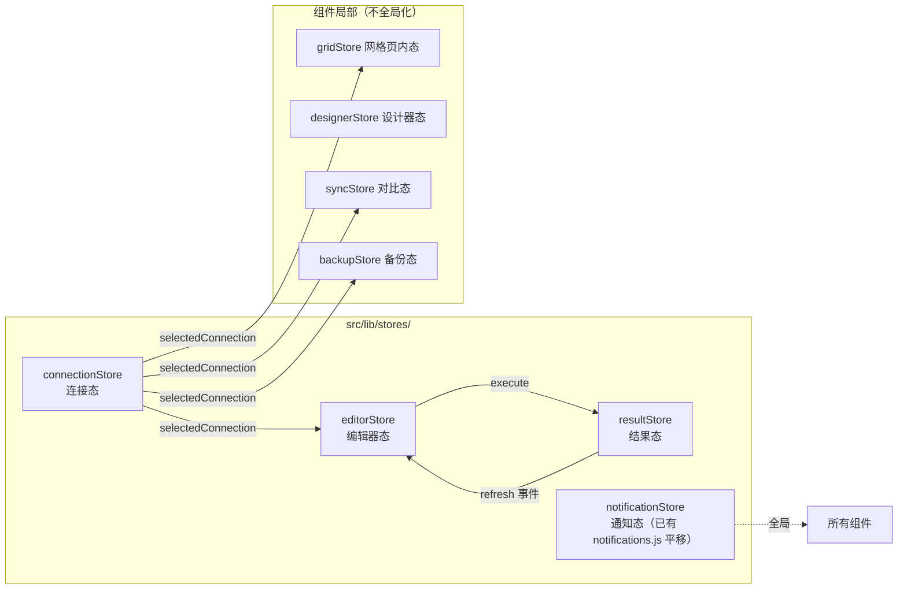

# QueryLab V1 状态管理（state-management）

> 版本：v1.0（2026-09-02，P7）
> 基线：现状状态分布（逆向报告 §2.2/§4 各组件自持状态 + App.svelte 工作区状态）+ P4 公共能力识别 + P6 V1 原型状态机（prototype/v1-new 实测口径）。
> 技术口径：Svelte 5 runes（`$state/$derived/$effect`）+ 模块级 store（`.svelte.ts`）；不引入外部状态库（tech-architecture §1.1）。

---

## 1. 划分总览

原则：
1. **连接态/编辑器态/结果态/通知态全局化**（跨视图共享）；网格/设计器/对比/备份为**视图内状态**（仅当前视图关心，保留组件内或独立 store 但不跨视图订阅）。
2. 单向数据流：组件 → action → store → 派生渲染；禁止组件互相 dispatch 传业务数据（现状 App.svelte executeQuery 直接被 SqlEditor 调用属隐式耦合，V1 收敛到 editorStore.execute()）。
3. 状态栏消息（statusMessage）由 resultStore/editorStore 派生（$derived），不独立存储。

---

## 2. connectionStore（连接态）

| 状态 | 类型 | 说明 |
|------|------|------|
| `connections` | ConnectionInfo[] | conn_list 结果 |
| `selectedId` | string \| null | 当前连接 |
| `selected` | $derived ConnectionInfo \| null | — |
| `databases` | string[] | 过滤系统库后 |
| `schemaCache` | Map&lt;db, TableInfo[]&gt; | 展开缓存（现 tablesData） |
| `expandedDbs` | Set&lt;string&gt; | — |
| `loadingDatabases` / `loadingTables` | boolean | — |
| `error` | string \| null | 加载错误 |

Actions：`loadAll() / select(id) / upsert(info) / remove(id) / test(info) / loadDatabases() / expandDb(db) / refreshDb(db) / refreshAll()`。

**联动规则（源自 App.svelte 事实 + B13 修正）**：
- `select(id)`：重置 resultStore/grid（视图回 query）；**编辑器 SQL 保留**，置 `editorStore.foreignSession=true`（B13 警示条）。
- `remove(id)` 且为当前连接：清空工作区**含编辑器 SQL**（B13 一致性修正）。
- conn 变更 → databases 重载；connList 刷新后保持 selectedId。

---

## 3. editorStore（编辑器态）

| 状态 | 类型 | 说明 |
|------|------|------|
| `sql` | string | 编辑器内容（localStorage 不持久化——历史另行存储） |
| `selection` | {start,end} \| null | 选中片段（执行优先） |
| `batchMode` / `useTransaction` | boolean | F016 |
| `showHistory` / `historyKeyword` | boolean / string | B7 搜索 |
| `history` | HistoryEntry[] | 会话级（见 data-model §5.1） |
| `historyLocalEnabled` | boolean | localStorage 偏好 |
| `historyNotice` | string \| null | 敏感拦截/开关反馈 |
| `statementsPreview` | $derived Statement[] | **B2：parseStatements(sql or selection) 结果 + 首条预览** |
| `foreignSession` | boolean | B13 警示条（SQL 来自上一连接） |
| `dialect` | $derived 'mysql' \| ... | **由 selected.driver 推导（B5 修正）** |

Actions：`setSql / execute()（分流普通/批量）/ format() / clear() / insertSnippet(s) / loadHistory(entry) / toggleHistoryMode() / clearHistory() / setKeyword(k)`。

执行动作内部：
1. `const stmts = sqlUtils.parseStatements(activeText())`；
2. 多条且非批量 → 先呈现 statementsPreview（UI 已有），执行时整批提交；
3. 批量 → 逐条驱动 resultStore.executeStatement() 并推进 batchProgress；
4. `pushHistory`（敏感词过滤在 sqlUtils.isSensitive）。

---

## 4. resultStore（结果态）

| 状态 | 类型 | 说明 |
|------|------|------|
| `loading` | boolean | 五态-加载 |
| `error` | string \| null | 五态-错误（连接失败/SQL 报错统一入口，保留「连接失败: 」「SQL 错误: 」前缀） |
| `result` | QueryResult \| null | — |
| `activeSetIndex` | number | 多结果 Tab（F023） |
| `editableTable` | string \| null | 单表直查判定（App.svelte extractEditableTableName 逻辑迁入） |
| `isEditable` | $derived boolean | editGuard（**结果/网格共用**，P4 PF-10 合一） |
| `editingCell` | {ri,ci,value,isNull} \| null | C12 统一可编辑单元格 |
| `updateMessage` | {ok,text} \| null | 更新反馈 |
| `lastQueryId` / `lastElapsed` | string / number | 信息条 |
| `exporting` | boolean | 导出 loading（**修复旧 exportLoading 恒 false**） |
| `batchProgress` | {stmts,idx,ok,fail,errors[]} \| null | **B3：BatchProgressPanel 数据源（接线后状态化）** |

Actions：`run(stmts) / runStatement(stmt) / setActive(i) / startEdit(ri,ci) / saveEdit() / cancelEdit() / toggleNull() / export(kind)`。

派生：`statusMessage = $derived(loading?'Executing...':error?'Query failed':result?('Query completed in '+elapsed+'ms'):'Ready')`（批量变体同 page-spec 一.1 全集）。

---

## 5. notificationStore（通知态）

现状 `src/lib/notifications.js`（toastStore/confirmStore）**直接平移**为 runes 版：
- `toasts: Toast[]`（success 3.2s / error 4.5s / info 3.2s；手动 ×）。
- `confirm: ConfirmRequest \| null` + `confirmAction(opts): Promise<boolean>`；并发时旧请求 resolve(false)；遮罩/Esc 取消。
- 不变式：同时至多一个 confirm；z-index 2000/2100 层级沿用（DS guidelines §2）。

---

## 6. 视图内状态（grid / designer / sync / backup）

| Store | 关键状态（源自组件事实） | 备注 |
|-------|--------------------------|------|
| gridStore | data{columns,rows,totalRows}、tableSchema、loading/error、currentPage/pageSize=50/totalPages、editingCell、newRow（逐列录入+自增排除）、selectedRows、updateMessage、filterText/filterColumn、showDeleteConfirm | supportsRowMutation → editGuard（与 resultStore 共用）；B9 Tab 保留值 |
| designerStore | mode(new/edit)、newTableName、columns/originalColumns、indexes（只读展示，C 类 PF-14）、tableInfo/originalTableInfo、loading/saving/error、hasChanges($derived 对比快照) | 校验文案全集见 components C21 |
| syncStore | sourceDatabase/targetDatabase、syncMode='structure'、comparing、syncResult(tableDifferences)、selectedTables、detailTable、syncError、syncing | SQL 生成/复制/导出/危险确认执行（B6 插值修正） |
| backupStore | activeTab(export/import)、selectedDatabase、selectedTables、exporting/exportProgress/exportStatus/exportResult、importFile/importDropExisting/importing/importProgress/importResult | db_export/db_import 映射 |

---

## 7. 与旧实现的迁移对照

| 旧（App.svelte/组件内 let） | 新（store） | 迁移注意 |
|------------------------------|-------------|----------|
| selectedConnection/databases/targetDatabase/isCreatingNewTable | connectionStore | select 联动规则按 §2 |
| viewMode/currentTableName | shellStore（或并入 connectionStore.workspace） | 条件视图按钮（grid/design 显隐）派生自 currentTableName |
| queryResult/queryError/queryLoading/editableResultTableName | resultStore | — |
| sql/batchMode/useTransaction/showHistory/persistHistory | editorStore | — |
| statusMessage | $derived（§4） | 不再手工赋值 |
| SqlEditor.parseStatements（未接线） | sqlUtils（editorStore 消费） | B2 |
| BatchProgressPanel（未接线） | resultStore.batchProgress | B3 |
| resetWorkspaceState() | connectionStore.select/remove 的联动 effect | 编辑器清空策略按 B13 |
