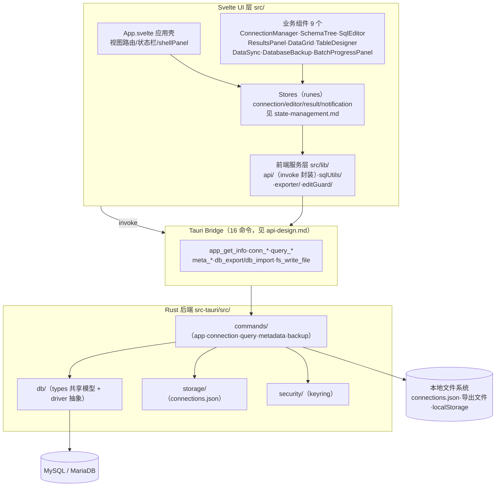
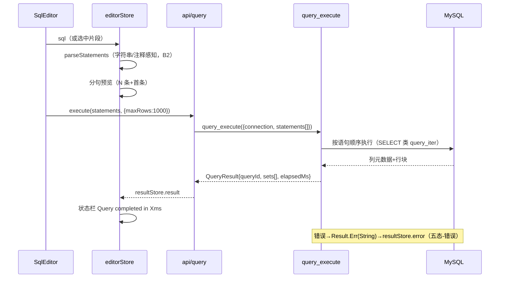
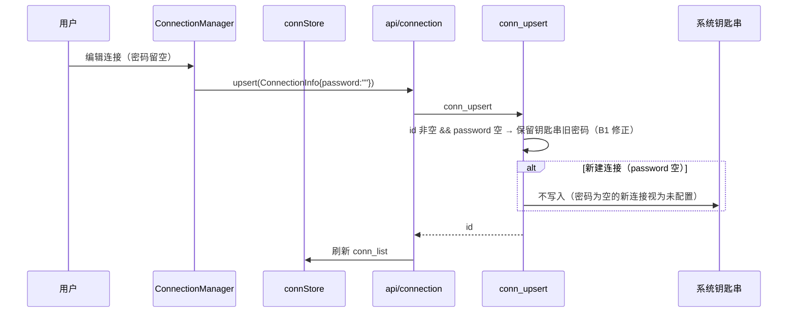
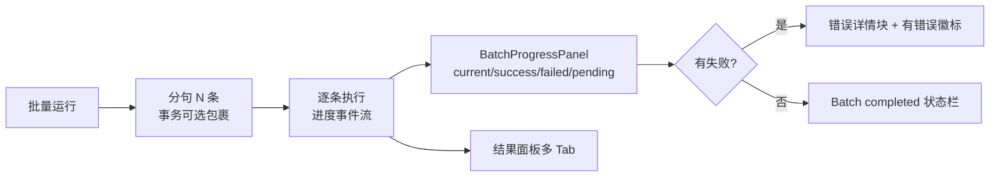

# QueryLab V1 技术架构（tech-architecture）

> 版本：v1.0（2026-09-02，P7）
> 依据：`docs/01_reverse/REVERSE_ANALYSIS.md`（逆向事实）、`docs/06_review/PRODUCT_REVIEW.md`（P4 分级）、`docs/07_design_system/`（P5）、`prototype/v1-new/app-prototype.html`（P6 V1 规格）。
> 标注口径：无标注=沿用既有事实或低风险决策；**【建议，待用户确认】**=重大调整，未经确认不得实施。

---

## 1. 选型结论

### 1.1 总体选型：延续 Svelte 5 + Tauri 2 + Rust + mysql_async（默认方案）

| 层 | 选型 | 理由（基于逆向事实） |
|----|------|---------------------|
| 前端框架 | **Svelte 5（传统模式 + mount API）** | ① 现有 9 个业务组件（约 9,300 行）可平滑迁移，重写成本最低；② V1 原型（P6）的信息架构与交互已按现有组件边界设计；③ Svelte 5 runes（$state/$derived）可直接落地 P7.3 的 store 划分，无需引入额外状态库；④ 桌面单窗口应用无 SSR/路由需求，Svelte 优势区间。 |
| 桌面壳 | **Tauri 2** | ① 16 个已注册 command 的 invoke 契约可延续（见 api-design.md 修正版）；② 窗口 1400×900/最小 1000×600 配置沿用 tauri.conf.json；③ 体积与内存占用相对 Electron 优势符合「本地优先、启动快」定位（README 当前目标）；④ tauri-plugin-shell 已用于 open 场景。 |
| 后端 | **Rust（edition 2021）** | 沿用 src-tauri 模块骨架（commands/db/storage/security/core/util），仅按 api-design 修正语义与补测试。 |
| 数据库驱动 | **mysql_async 0.34** | 首期仅 MySQL/MariaDB；异步驱动与 Tauri command 的 async 语义匹配。 |
| 密钥/配置 | keyring 1.1 + dirs 5 | 钥匙串方案已验证（service com.i2kai.querylab.connection），V1 延续并修复密码保留语义（见 api-design §conn_upsert）。 |
| 编辑器 | CodeMirror 6（lang-sql/autocomplete/search/one-dark） | 现有集成完整；V1 仅修复方言字段错配（B5）并接线表名补全（B8）。 |
| 测试 | vitest + @testing-library/svelte + jsdom；cargo test | 沿用既有 3 组件测试 + 2 存储单测基线，按 api-design 新增契约测试。 |

**不引入**：Redux/Pinia 类状态库（Svelte runes 足够）、TypeScript 迁移**【建议，待用户确认】**（现有代码为 JS，V1 范围内建议仅对 `src/lib/api/` 新层采用 JSDoc 类型标注，全量 TS 迁移另立决策）、Electron/Flutter 重写（无收益依据）。

### 1.2 候选增强（全部【建议，待用户确认】，对应 P4 C 类）

| 增强项 | 触发条件 | 说明 |
|--------|----------|------|
| 连接池 / 运行时连接句柄（C10） | 用户反馈首查询慢 | 现状每命令新建连接（mysql_async Conn::new）；引入 once_cell 全局池或 core/state.rs SessionManager 落地 |
| 查询取消 query_cancel（C3） | 长查询卡 UI | 需后端任务表 + CancellationToken；core/state.rs TaskManager 骨架已有 |
| 分页拉取 query_fetch_more（C3） | 结果 > maxRows=1000 截断痛点 | QueryResultSet.paging 字段已预留（恒 None） |
| SQLite/PostgreSQL（C12） | 扩库需求 | db/driver.rs Driver trait 占位可承载，需按 Capabilities 重构命令层 |

---

## 2. 分层架构（V1 目标态）

要点：
1. **新增 `src/lib/api/` 统一 invoke 层**（P4 §4.3 缺失项）：所有命令调用收敛到一处，统一错误文案映射与超时，禁止组件直接 invoke（现状 8 个组件各自 invoke）。
2. **前端服务层提取**：sqlUtils（parseStatements/formatSql/escape）、exporter（CSV/JSON/SQL+文件名规则）、editGuard（两处门禁合一）。
3. **BatchProgressPanel 必须接线**（B3）：由 App.svelte 在批量执行时挂载，事件流见 §4。
4. 死代码清理（随 V1 一并处理）：`src/lib/Counter.svelte` 删除；`core/state.rs`、`core/errors.rs`、`util/mod.rs`、`db/driver.rs` 占位要么在增强项中启用要么删除（保留会持续产生 dead_code 警告）；**`src-ui/` 整目录删除【建议，待用户确认】**（见 module-split.md §5）。

---

## 3. 关键数据流

### 3.1 查询执行（修正后：分句归属前端）

> 契约修正依据：旧项目后端按 `;` 裸拆（query.rs L120-124）拆坏含分号字符串；前端 parseStatements 已实现未接线（P4 PF-02/B2）。分句算法唯一实现放 `src/lib/sqlUtils`，后端只接收语句数组（或后端引入同一算法 crate 化——两选一，默认前者，见 api-design §3.1）。

### 3.2 连接生命周期（修正后：密码保留语义）

### 3.3 批量执行 + 进度面板（B3 接线后）

实现建议：query_execute 增加可选 `on_statement` 事件（Tauri emit）或前端按语句逐条调用（N 次 invoke）——默认**前端逐条调用**（改动最小，无后端事件系统依赖），事务模式仍整体提交。

---

## 4. 部署与窗口

- 窗口：1400×900 默认 / 1000×600 最小（tauri.conf.json 沿用）；V1 原型评审画框与此一致。
- 打包：Tauri 2 默认产物（dmg/msi/AppImage）；identifier `com.i2kai.querylab` 不变。
- 成品化清理（随 V1）：`index.html` 标题 querylab-ui → QueryLab；移除 public/vite.svg 模板残留（逆向⑨.11）。

## 5. 风险与决策点汇总

| 风险/决策 | 等级 | 处置 |
|-----------|------|------|
| 每命令新建连接的性能 | 中 | C10 连接池【建议，待用户确认】 |
| Result&lt;T, String&gt; 错误模型过简（无错误码） | 中 | C14 统一返回结构【建议，待用户确认】；默认保留 String+前缀文案（「连接失败: 」「SQL 错误: 」），前端按前缀归类 |
| src-ui 双工作区漂移 | 高（口径冲突） | C9 删除【建议，待用户确认】 |
| 密码迁移路径（明文→钥匙串）已内建 | 低 | 保持 load_all 迁移逻辑 + 新增单测 |
| history 存 localStorage（无后端 history_*） | 低 | C5 收藏/模板决策前维持现状 |
