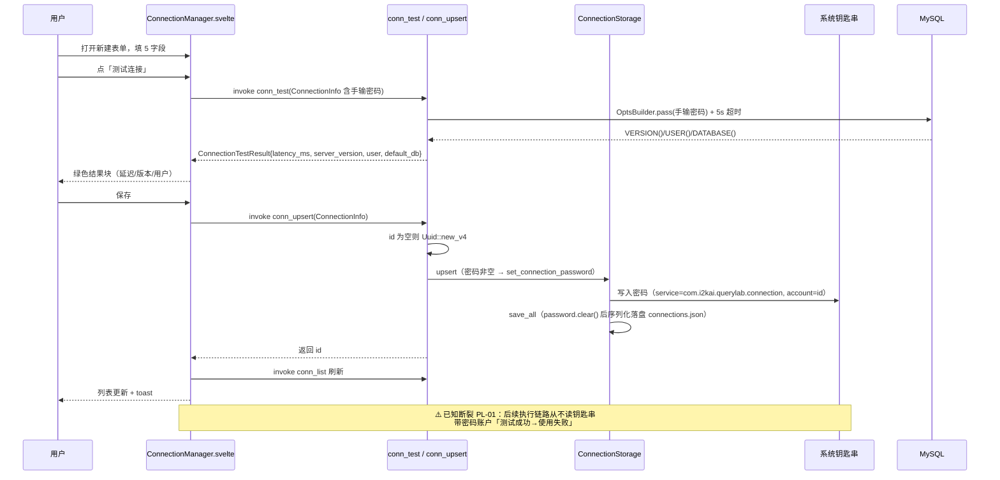
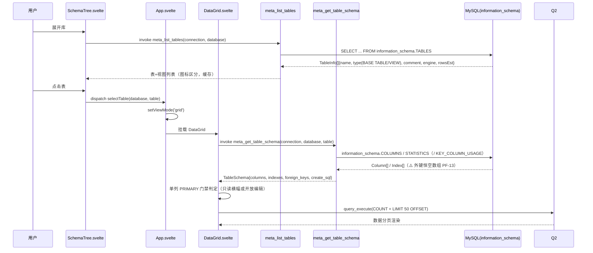
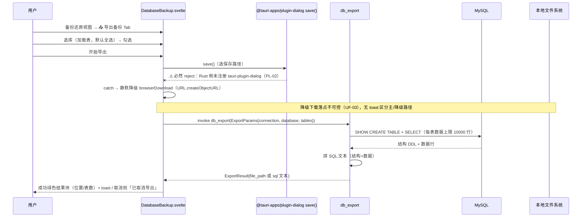
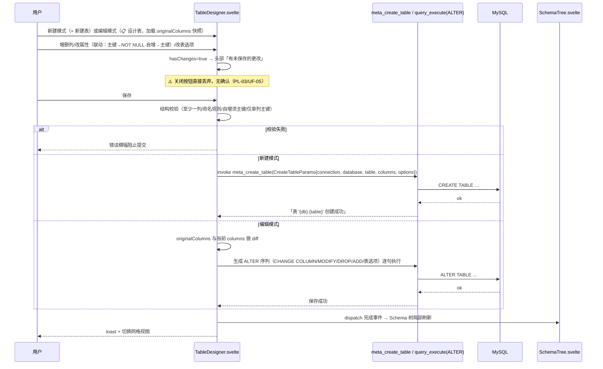

# QueryLab 时序图集（SEQUENCE_DIAGRAMS）

> 编制日期：2026-09-03（SOP v2.0 编号文档体系迁移时新建）
> 事实来源：`src-tauri/src/commands/{connection,query,metadata,backup,app}.rs`（逐文件核实）、`src/App.svelte`、`src/components/*.svelte`、`docs/04_architecture/SYSTEM_ARCH.md` §3 关键数据流、`docs/product-review/PRODUCT_LOGIC_REVIEW.md`（PL-01/PL-02）、`docs/product-review/USER_FLOW_REVIEW.md`。现状（As-Is）与已知断裂均标注；未实测行为标【未知】。

---

## 图 1：新建连接 + 测试连接（现状）



## 图 2：执行查询（现状，query_execute）

```mermaid
sequenceDiagram
    participant U as 用户
    participant E as SqlEditor.svelte
    participant A as App.svelte
    participant Q as query_execute
    participant MY as MySQL
    participant R as ResultsPanel.svelte
    U->>E: 编写 SQL，Ctrl+Enter（选中优先）
    E->>A: dispatch execute(sql)
    A->>A: 检查 selectedConnection（未选 → toast 请先选择连接）
    A->>Q: invoke query_execute({connection, sql})
    Q->>Q: 按 ; 裸分句 ⚠️ PF-02（拆坏含分号字符串/注释）
    loop 每条语句
        Q->>MY: 新建连接（无池化；密码为空串 ⚠️ PL-01）执行
        MY-->>Q: 列元数据 + 行流 / 错误
    end
    Q-->>A: QueryResultSet{setIndex, columns, meta{elapsedMs,affectedRows}, chunks, paging} / Err(String)
    A->>A: 状态栏 Query completed in Xms / Query failed
    A->>R: queryResult / queryError（五态渲染，多 Tab）
    R->>R: 历史入库（SqlEditor：去重置顶，敏感词过滤）
    Note over Q,MY: ⚠️ 无超时无取消（UF-02）：慢查询时「执行中」态无终点
```

## 图 3：浏览表结构（meta_get_table_schema，点表进网格）



## 图 4：备份导出（db_export，现状含断裂）



> 对照——导入侧（db_import）：`open()` 同样必然 reject 且无降级，仅 console.error，importFile 恒空，「开始导入」永久禁用（UF-06/PL-02）。

## 图 5：表设计器保存（新建 meta_create_table / 编辑 diff→ALTER）



## 附：图间共性的已知断裂索引

| 断裂点 | 影响的图 | 编号 |
|--------|----------|------|
| 凭据链路（密码 skip_serializing + 执行链路不读钥匙串） | 图 1/2/3/4/5 全部执行类步骤 | PL-01 |
| plugin-dialog 未注册（save/open 必然 reject） | 图 4（及导出类流程） | PL-02 |
| 按 `;` 裸分句 | 图 2（批量/多语句场景） | PF-02 |
| 无超时无取消 | 图 2 | UF-02 |
| 外键恒空 | 图 3 | PF-13 |
| 关闭无确认 | 图 5 | PL-03 |
