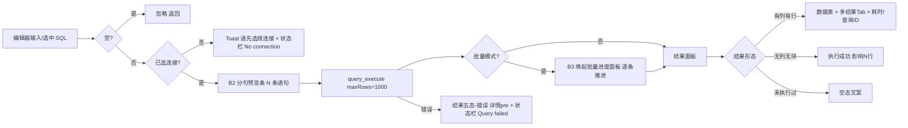

# QueryLab Design System — 交互模式（patterns）

> 版本：v1.0（2026-09-02）
> 模式均提炼自旧项目真实交互（来源注明），是 V1 原型与开发实现的一致性契约。

---

## P1 查询-结果流转模式（Query → Result Flow）

**来源**：App.svelte executeQuery/handleBatchExecute + SqlEditor execute + ResultsPanel。

规则：
1. 选中 SQL 优先于全文执行（F015）。
2. 结果面板五态互斥，同一时刻只呈现一态（见 P6 空态/状态模式）。
3. 状态栏消息与结果面板状态一一对应（Executing… / Query completed in Xms / Query failed）。
4. 新结果到达（queryId 变化）重置结果 Tab、编辑态与更新消息。
5. B2：执行前分句预览必须正确处理字符串内分号/注释（修复按 `;` 裸拆）。

---

## P2 表单校验模式（Form Validation）

**来源**：ConnectionManager（保存失败红块）、TableDesigner validateSchema（错误横幅）、SchemaTree 新建库（空名 notifyError）、DatabaseBackup（未选库/表/文件 notifyError）。

规则：
1. **轻表单**（连接/新建库/备份）：提交时校验，失败用 Toast（notifyError）或表单内红块；不做逐字段实时校验。
2. **结构化表单**（表设计器）：保存时集中校验，错误横幅置顶展示全部问题（阻断提交）；文案用源码原文（见 components C21）。
3. 校验失败不清空用户输入。
4. 危险前置（导入先删表）：用复选框显式勾选 + 结果块反馈，不阻断表单其余部分。

---

## P3 危险操作确认模式（Danger Confirmation）

**来源**：notifications.js confirmAction（Promise<boolean>）+ 六处调用点。

| 要素 | 规格 |
|------|------|
| 触发 | 所有不可逆操作：删除连接、删除表、清空表（TRUNCATE）、网格删除行、执行结构变更、（提示性）导入删表 |
| 呈现 | 全局遮罩 + 对话框（C18）；tone=danger 确认钮红底 |
| 文案 | 标题「删除/清空 XX」+ 正文含后果说明；删除表为「⚠️ 此操作不可撤销！表结构和数据将被永久删除！」；结构变更为「此操作会直接修改目标数据库结构，且不可撤销。建议先完成 SQL 备份。」 |
| 取消 | 遮罩点击 / Esc / 取消按钮 → resolve(false)，不执行 |
| 并发 | 同时只允许一个确认；新确认自动 resolve(false) 旧的 |
| 完成反馈 | 成功 Toast（「表删除成功」「成功删除 N 行」等源码文案）+ 局部刷新 |

规则：新增危险操作必须复用本模式，禁止 alert/confirm（旧项目已有此约束，RELEASE_VERIFICATION 记录）。

---

## P4 空态模式（Empty State）

**来源**：各组件空态文案（page-spec 一.11 基准）。

| 场景 | 文案（源码原文） | 附加 |
|------|------------------|------|
| 连接列表空 | 「暂无连接，点击 + 新建」 | 引导新建 |
| Schema 未连接 | 「请先选择连接」 | — |
| 库列表空 | 「无可用数据库」 | — |
| 表列表空 | 「无表」 | — |
| 结果初始 | 「执行 SQL 后结果显示在这里」 | — |
| 空结果集 | 列头保留 + 0 行 Tab | — |
| 空表网格 | 列头保留 + 「📭 此表当前没有数据」+ 表名（V1 图标化） | — |
| 历史空 | 「暂无历史记录」 | — |
| 历史无匹配 | 「无匹配历史」（V1 新增，B7） | — |
| 结构无差异 | 「没有发现结构差异，两个数据库结构相同」 | — |
| 无列数据 | 「无数据」 | — |

规则：空态保留上下文（列头/工具栏不消失），文案不指责用户，可操作的空态给引导（连接空态）。

---

## P5 加载模式（Loading）

**来源**：各组件。文案：库/表「加载中...」、查询「执行中...」、对比「比较中...」、导出「正在导出...」、导入「导入中...」（V1 补充统一）、保存「保存中...」、测试「测试中...」。

规则：
1. 加载期间对应触发按钮禁用并显示进行时文案（源码事实：测试按钮 '...'/'测试中...'）。
2. 加载态不锁定整个窗口，只锁对应区域（结果区 spinner、树区文字）。
3. 导出按钮 loading（V1 修复：旧项目 exportLoading 恒 false）。

---

## P6 五态状态机（页面状态总纲）

V1 原型场景库必须可切换五态：**Loading / Empty / Error（连接失败 + SQL 报错两类）/ Success / Permission（门禁只读）**。

| 态 | 主呈现 | 来源 |
|----|--------|------|
| Loading | C16 | ResultsPanel/DataGrid/DataSync/DatabaseBackup |
| Empty | C15 | P4 表 |
| Error-连接 | 「连接失败: {err}」/「连接超时（5秒）」 | conn_test/query 错误路径 |
| Error-SQL | ⚠ + 错误 pre（errno 1064 类全文） | ResultsPanel 错误态 |
| Success | 数据表/成功消息/结果块/Toast | 全链路 |
| Permission(门禁) | 只读横幅（网格）/ 只读原因提示（结果面板，B11 新增） | supportsRowMutation/isEditable |

---

## P7 编辑门禁模式（Edit Guard）

**来源**：ResultsPanel isEditable（L196-205）+ DataGrid supportsRowMutation + App extractEditableTableName（L75-92）。

1. 网格：表存在**单列 PRIMARY 且出现在结果列** → 开放更新/删除（复选框可用）；否则只读横幅「当前表未检测到单列主键，网格视图仅支持浏览、筛选、导出和插入；更新与删除已禁用。」；插入始终可用。
2. 结果面板：SQL 为单条 `SELECT * FROM \`db\`.\`table\`[ LIMIT n]` 且 sets=1 且表单列主键且主键列在结果列 → 可编辑；主键列本身不可编辑。
3. 门禁判定必须给**原因**（B11：结果面板静默只读 → 增加原因提示）。
4. 视图（VIEW）拦截：重命名/清空提示「视图不支持重命名/清空」（notifyInfo）。

---

## P8 导出模式（Export）

**来源**：ResultsPanel/DataGrid 导出 + DatabaseBackup db_export。

1. 生成内容 → 系统 save 对话框（默认文件名）→ fs_write_file 落盘 → 成功 Toast「导出成功: {文件名}」。
2. 取消对话框 → notifyInfo「已取消导出」（不报错）。
3. 文件名规则（V1 统一，B4）：结果导出 `{表名|query_前8位}_{时间戳}.csv|.json`；网格导出 `{表}_{时间戳}.csv|.json|.sql`；备份 `{db}_backup_{ts}.sql`；结构对比 `sync_{src}_to_{dst}_{ts}.sql`。**不得为空**。
4. 失败 → 错误 Toast/结果块（浏览器降级下载属实现细节，V1 不模拟）。

---

## P9 结构变更执行模式（DDL Execution）

**来源**：SchemaTree DDL（RENAME/TRUNCATE/DROP）、TableDesigner diff→ALTER、DataSync 执行同步。

1. 变更来源三处：表级右键操作（直接 SQL）、设计器 diff（生成 ALTER 序列逐条执行）、结构对比（勾选差异表逐句执行）。
2. 均走 query_execute（maxRows=0）；执行前危险确认（P3）；成功 toast + Schema 树/库列表局部刷新（refreshDatabase/refreshAll/syncComplete 事件链）。
3. 「新增表」差异仅生成注释「需要手动创建」（承诺边界，如实呈现）。

---

## P10 历史与敏感信息模式（History & Sensitive）

**来源**：SqlEditor 历史（localStorage `querylab_sql_history` / `querylab_sql_history_enabled`）。

1. 双模式：会话（默认）/ 本地（开关切换，偏好落 localStorage）。
2. 敏感词正则（password/secret/token/api[_-]?key/access[_-]?key/private[_-]?key/credential）命中 → 不落本地 + 提示条「仅保留当前会话，不会写入本地历史」。
3. 去重置顶、上限 100、可清空；条目点击回填编辑器。
4. 密码字段：任何界面不回显、不落盘（钥匙串存储，见 tokens/components B1）。

---

## P11 状态栏反馈模式（Status Feedback）

**来源**：App.svelte statusMessage。状态栏=概要（一行），详情面板=全文；消息集见 C31。V1 延续该分层（P4 D1）。

---

## P12 通知分级模式（Toast Levels）

success（绿 3.2s）/ error（红 4.5s）/ info（蓝 3.2s）；可 × 关闭；叠加栈。操作成功→success；失败→error；中性提示/取消→info。
