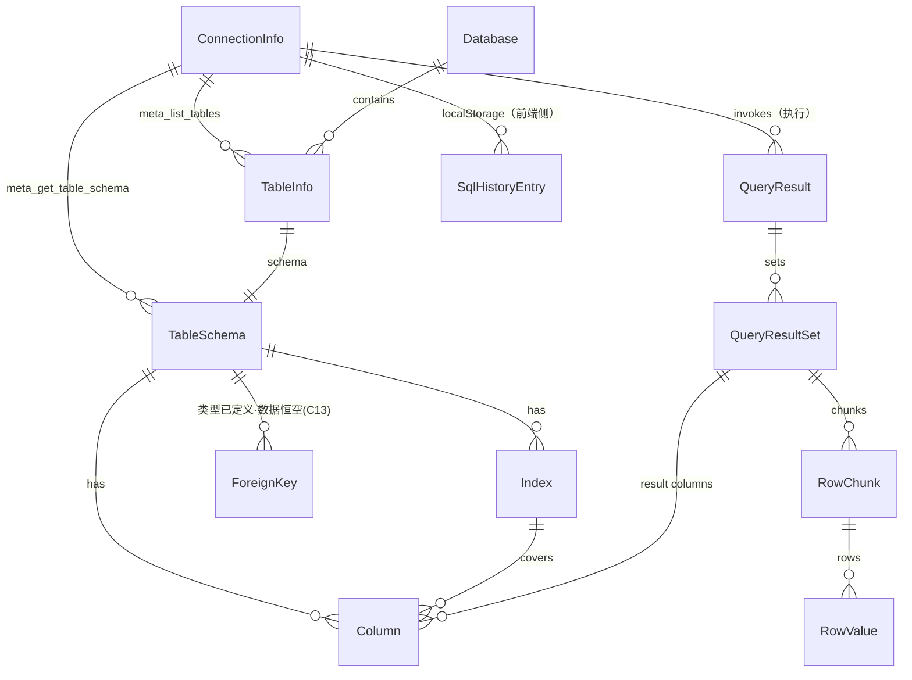

# QueryLab V1 数据模型（data-model）

> 版本：v1.0（2026-09-02，P7）
> 基线：`docs/01_reverse/REVERSE_ANALYSIS.md` §⑦（逆向事实模型，字段名/serde rename 均核对源码）；本文件在其上做 V1 修正标注（B1 密码语义、B2 分句、结果导出命名）并补充 ER 图与持久化清单。
> 实体定义源：`src-tauri/src/db/types.rs`、`src-tauri/src/db/driver.rs`、`src-tauri/src/commands/*.rs`、`src/components/SqlEditor.svelte`（前端本地实体）。

---

## 1. 实体总览（ER）

---

## 2. 连接域（ConnectionInfo 及派生）

### 2.1 ConnectionInfo（`db/driver.rs` L56-70；JSON 契约 = serde 字段名）

| 字段 | JSON 名 | 类型 | 约束/默认 | V1 说明 |
|------|---------|------|-----------|---------|
| id | `id` | String(UUID) | conn_upsert 空则后端生成 | 主键；钥匙串 account 同此值 |
| name | `name` | String | 可空（缺省显示 host） | — |
| driver_type | **`driver`** | String | 'mysql' | **方言判定唯一依据（B5 修正：前端误读 `dialect` 属缺陷）** |
| host | `host` | String | 必填 | — |
| port | `port` | u16 | 3306 | — |
| user | `user` | String | 必填 | — |
| password | （skip_serializing，不出现在任何 JSON） | String | — | **B1 语义修正：`conn_upsert` 时 password 为空且 id 非空 = 保留钥匙串旧密码（旧实现会清空，属缺陷）** |
| default_db | **`defaultDb`** | Option&lt;String&gt; | None | — |

### 2.2 持久化

- 文件：`{dirs::config_dir()}/querylab/connections.json`（数组；写入前 password 恒 clear——保留此行为）。
- 钥匙串：service `com.i2kai.querylab.connection`，account=连接 id，value=密码。
- 读取时明文密码自动迁移入钥匙串（load_all 既有逻辑，保留 + 单测）。

### 2.3 ConnectionTestResult（`commands/connection.rs` L45-51）

`{ latency_ms: u64, server_version: String, user: String, default_db: Option<String> }`；5 秒超时（tokio timeout）。

---

## 3. 元数据域（Database / TableInfo / TableSchema / Column / Index / ForeignKey）

### 3.1 TableInfo（`db/driver.rs` L73-85；来源 information_schema.TABLES）

| 字段 | JSON 名 | 类型 | 说明 |
|------|---------|------|------|
| name | `name` | String | 表/视图名 |
| table_type | **`type`** | String | `BASE TABLE` / `VIEW` |
| comment | `comment` | Option&lt;String&gt; | 注释（无则不序列化） |
| engine | `engine` | Option&lt;String&gt; | 引擎 |
| rows_est | **`rowsEst`** | Option&lt;u64&gt; | 行数估计 |

### 3.2 Column（`db/types.rs` L7-20）

`{ name, type(=COLUMN_TYPE), nullable, default?, comment?, extra? }`（extra 如 `auto_increment`）。

### 3.3 Index（`db/types.rs` L22-28；来源 STATISTICS 聚合）

`{ name, unique, columns[] }`。

### 3.4 ForeignKey（`db/types.rs` L30-38）

`{ name, columns[], refTable, refColumns[] }`——**类型已定义，meta_get_table_schema 恒返回 `[]`（metadata.rs L368）；是否补实现属 C13【待用户确认】，V1 不虚构。**

### 3.5 TableSchema（`db/types.rs` L41-52）

`{ database, table, columns[], indexes[], foreign_keys[], create_sql? }`（create_sql 来自 SHOW CREATE TABLE）。

---

## 4. 查询结果域（QueryResult 系列，`commands/query.rs` + `db/types.rs`）

### 4.1 QueryResult

`{ queryId: UUID, sets: QueryResultSet[], elapsedMs: u64 }`。

### 4.2 QueryResultSet

`{ setIndex, columns: Column[], meta: { columns[], affectedRows, elapsedMs, warningCount }, chunks: RowChunk[], paging: Option<PagingInfo>（现恒 None） }`。

### 4.3 RowChunk / RowValue / PagingInfo

- RowChunk：`{ chunkIndex, rows: RowValue[][] }`。
- RowValue（untagged enum）：`Null | Bool | Number(i64) | Float(f64) | String | Bytes([u8])`。
- PagingInfo：`{ offset, pageSize, hasMore }`（分页拉取属 C3【待用户确认】时启用）。

### 4.4 执行入参（V1 修正）

| 项 | 旧（事实） | V1（修正） |
|----|-----------|-----------|
| 语句来源 | `sql: String`，后端按 `;` split（缺陷） | **`statements: String[]`，前端 sqlUtils.parseStatements 分句后传入（B2）**；`sql` 字段保留兼容一个版本 |
| maxRows | `max_rows: usize`（前端传 1000） | 不变 |
| 批量进度 | 无（BatchProgressPanel 未接线） | 前端按语句逐条调用驱动进度面板（tech-architecture §3.3） |

### 4.5 UpdateCellParams / UpdateCellResult（`commands/query.rs` L11-33）

`{ connection, table("db.table"), column, primary_key, primary_key_value, new_value, is_null }` → `{ success, message, affectedRows }`；SQL 形态 `UPDATE … SET … WHERE pk=v LIMIT 1`。

---

## 5. 前端本地实体

### 5.1 SQL 历史（localStorage，`SqlEditor.svelte` L31-32）

| 键 | 结构 | 规则 |
|----|------|------|
| `querylab_sql_history` | `[{sql: String, timestamp: Number, date: String}]` | 去重置顶、上限 100（MAX_HISTORY） |
| `querylab_sql_history_enabled` | `'true'/'false'` | 默认 false（仅会话） |

敏感词正则（不落本地）：`password|secret|token|api[_-]?key|access[_-]?key|private[_-]?key|credential`（不区分大小写）。

### 5.2 代码片段（前端常量）

`snippets: {name, sql}[]`，24 项内置（逆向 §7.5 清单）。

### 5.3 导出命名规则（B4 统一，V1 新增约定）

| 场景 | 文件名 |
|------|--------|
| 结果导出（单表直查） | `{table}_{ts}.csv/.json` |
| 结果导出（任意查询） | `query_{queryId 前 8 位}_{ts}.csv/.json`（兜底，不得为空） |
| 网格导出 | `{table}_{ts}.csv/.json/.sql` |
| 备份导出 | `{db}_backup_{ts}.sql` |
| 结构对比导出 | `sync_{src}_to_{dst}_{ts}.sql` |

---

## 6. 备份域（`commands/backup.rs` L13-48）

- ExportParams：`{ connection, database, tables[], export_type: 'structure'|'data'|'both', format: 'sql'|'json'|'csv', file_path }`（前端仅开放 both+sql，后端能力保留）。
- ExportResult：`{ success, size, tables, message }`。
- ImportParams：`{ connection, database, file_path, drop_existing }`。
- ImportResult：`{ success, tables, rows, message }`。
- 备份文件格式：SQL 文本（头部注释 + USE 库 + 每表 DROP IF EXISTS + CREATE TABLE + INSERT，每表上限 10000 行）。
- 已知限制：split_sql_statements 不处理注释内分号/DELIMITER/存储过程（逆向⑨.2）——V1 分句算法统一后此处同步受益（同一 sqlUtils 语义在 Rust 侧实现，见 api-design §3.1）。

---

## 7. 状态域派生模型（对齐 state-management.md）

编辑器/结果/网格等前端运行态实体（编辑单元格、新行、筛选、分页、diff 选择集等）定义见 `state-management.md` §3-§6；持久化实体仅上述 2.2/5.1/6 三处。
