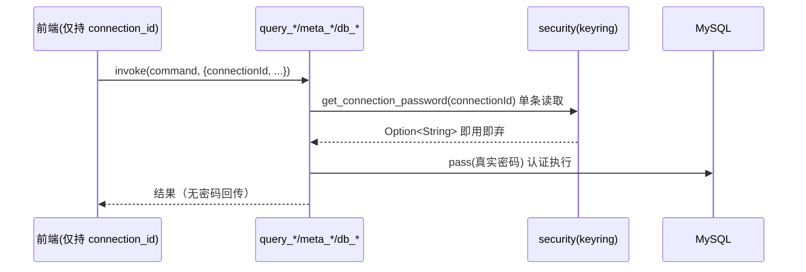

# QueryLab 权限规格（PERMISSION）

> 编制日期：2026-09-03（SOP v2.0 编号文档体系迁移时新建）
> 现状来源：`src-tauri/src/security/mod.rs`、`src-tauri/src/storage/connections.rs`、`src-tauri/src/commands/app.rs`、`src-tauri/src/commands/backup.rs`、`src-tauri/src/main.rs`、`src-tauri/tauri.conf.json`、`src-tauri/Cargo.toml`、`package.json`；评审来源：`docs/product-review/PERMISSION_REVIEW.md`（PM-01…PM-07，2026-09-03）与 `docs/product-review/PRODUCT_LOGIC_REVIEW.md`（PL-01/02/04）。「目标态」为评审建议方向的规格化表述，待用户决策后落地。
> 实测限制：无打包产物运行验证，Tauri 运行时权限行为按 Tauri 2 机制与源码配置推断（涉及处注明）。

---

## 1. 现状：权限能力清单

### 1.1 系统钥匙串（keyring 1.1.0）

| 操作 | 接口 | 调用时机 | 触发方 |
|------|------|----------|--------|
| 写入密码 | set_connection_password（security/mod.rs L11-16） | conn_upsert 且密码非空；load_all 明文迁移 | 用户显式保存 |
| 读取密码 | get_connection_password（L18-25） | **仅** load_all——每次 conn_list/upsert/delete 批量读全部连接密码入内存 | 应用启动、每次连接管理操作 |
| 删除密码 | delete_connection_password（L27-33） | conn_upsert 且密码为空（编辑不重输即误删，PF-01）；conn_delete | 用户保存/删除连接 |

- 授权特征：service=`com.i2kai.querylab.connection`，按连接 id 分条存取；首次访问由 OS 钥匙串按应用签名授权（应用未签名时行为【未知——无打包产物验证】）。
- 时机评估（PM-04）：高频批量读取（每次列表操作）服务于零消费的用途（读取结果被 skip_serializing 丢弃），执行链路需要时反而不读（PL-01）。

### 1.2 Tauri 系统能力面（插件/命令/CSP/capabilities 注册现状）

| 能力 | 声明/注册现状 | 前端消费 | 评估 |
|------|---------------|----------|------|
| tauri-plugin-shell | Cargo.toml + main.rs L20 注册 + tauri.conf.json `plugins.shell.open:true` | **零调用**（全局 grep） | 死能力面（PM-03，C） |
| @tauri-apps/plugin-dialog（save/open） | 仅前端 npm 依赖；**Rust 侧无 crate、未注册、无 capabilities** | ResultsPanel/DataGrid（save）、DatabaseBackup（save+open） | 必然运行时失败（PL-02，B） |
| fs_write_file（自定义命令） | generate_handler 注册（app.rs L29-36） | 导出链路 3 组件 | **无路径作用域限制 + create_dir_all**（PM-01，B） |
| db_import（自定义命令） | generate_handler 注册 | 备份导入 | **任意路径文件读取**（PM-02，B） |
| 其余 14 个命令 | generate_handler 注册（共 16 个） | 各组件 | 数据库操作，无文件系统能力 |
| CSP（tauri.conf.json security.csp） | **未配置**（无 security 节） | — | 默认无内容安全策略（PM-01 关联） |
| capabilities/ 目录（Tauri 2 ACL） | **不存在**（仅 gen/schemas 生成物） | — | 未启用显式授权模型（PM-07，C） |
| withGlobalTauri | false（tauri.conf.json L13） | — | 正面（缩小注入面） |

### 1.3 数据库凭据授权模型

| 事项 | 现状 |
|------|------|
| 凭据持有 | 前端全量持有连接参数对象并逐命令回传；密码因 skip_serializing 恒缺（PL-01）——授权链路断链 |
| 语句级授权 | query_execute 执行任意 SQL；树/网格六类危险操作有 UI 确认，编辑器直接执行 DROP/TRUNCATE 无确认（PL-04） |
| 只读模式 | 无「只读连接」开关（PM-05，C） |
| 权限错误 | MySQL 报错原文透传，无解释性包装（UF-07） |

## 2. 已知问题（编号索引，详见 PERMISSION_REVIEW）

| 编号 | 级别 | 问题 |
|------|------|------|
| PM-01 | B | fs_write_file 无作用域限制任意路径写 + 无 CSP（webview 若 XSS 即获持久化写原语） |
| PM-02 | B | db_import 任意路径文件读原语 |
| PM-03 | C | shell 插件注册但零消费（open:true 宽松配置） |
| PM-04 | B | keychain 密码批量读入内存时机过宽（与 DS-01/PL-01 一体） |
| PM-05 | C | 无只读连接/语句防护选项 |
| PM-06 | D-正面 | 密码不出现在序列化输出与磁盘文件（单测锁定） |
| PM-07 | C | 未启用 Tauri 2 capabilities 显式授权模型 |

## 3. 目标态权限规格

### 3.1 能力矩阵（重建后）

| 能力 | 目标态 | 依据 |
|------|--------|------|
| 钥匙串读取 | 按 connection_id 单条读取、执行时即用即弃；load_all 不再回填密码 | PL-01/PM-04 修复方向 |
| 原生对话框 | Rust 侧引入 tauri-plugin-dialog + main.rs 注册 + capabilities 授权 dialog:allow-save/open | PL-02 修复方向 |
| 文件写 | fs_write_file 收敛为白名单目录（对话框返回路径/导出目录），拒绝任意路径与静默覆盖；或改走 dialog+fs 插件作用域 | PM-01 |
| 文件读（导入） | 路径来源校验（dialog 返回），限制扩展名 .sql | PM-02 |
| shell 插件 | 移除，或保留并声明用途 + capabilities 精确授权 | PM-03（用户决策） |
| CSP | tauri.conf.json 配置 security.csp（默认收严：脚本 self、禁远程源） | PM-01 ① |
| capabilities | 建立 `src-tauri/capabilities/default.json`：core 最小集 + dialog + 按需 fs scope | PM-07 |
| 只读连接 | 可选连接级只读开关（后端拒绝非 SELECT 或 SET SESSION TRANSACTION READ ONLY）——范围决策 | PM-05（用户决策） |
| 危险语句 | 编辑器执行 DROP/TRUNCATE 等纳入确认或事务提示（第七类对称） | PL-04（用户决策） |

### 3.2 目标态 capabilities 声明草案（示意，落地时按 Tauri 2 ACL 语法冻结）

```json
{
  "identifier": "default",
  "windows": ["main"],
  "permissions": [
    "core:default",
    "dialog:allow-save",
    "dialog:allow-open"
  ]
}
```

> 说明：自定义命令（conn_*/meta_*/query_*/db_*）不依赖 ACL，其收敛靠 §3.1 的白名单逻辑；fs 若启用插件则按导出目录 scope 声明。shell 是否保留待 PM-03 决策。

### 3.3 凭据流目标态



配套：命令契约改 connection_id 入参（API_SPEC 修订）；密码不落盘属性保持（PM-06 不动）。

## 4. 关联阅读

- 评审全文：`docs/product-review/PERMISSION_REVIEW.md`
- 凭据断裂详述：`docs/product-review/PRODUCT_LOGIC_REVIEW.md` §四 PL-01；`docs/03_flow/BUSINESS_FLOW.md` §6
- 数据流与存储：`docs/04_architecture/DATA_FLOW.md`
- 技术栈断裂清单：`docs/00_context/TECH_STACK.md` §4；依赖：`docs/00_context/DEPENDENCY_LIST.md` §4
