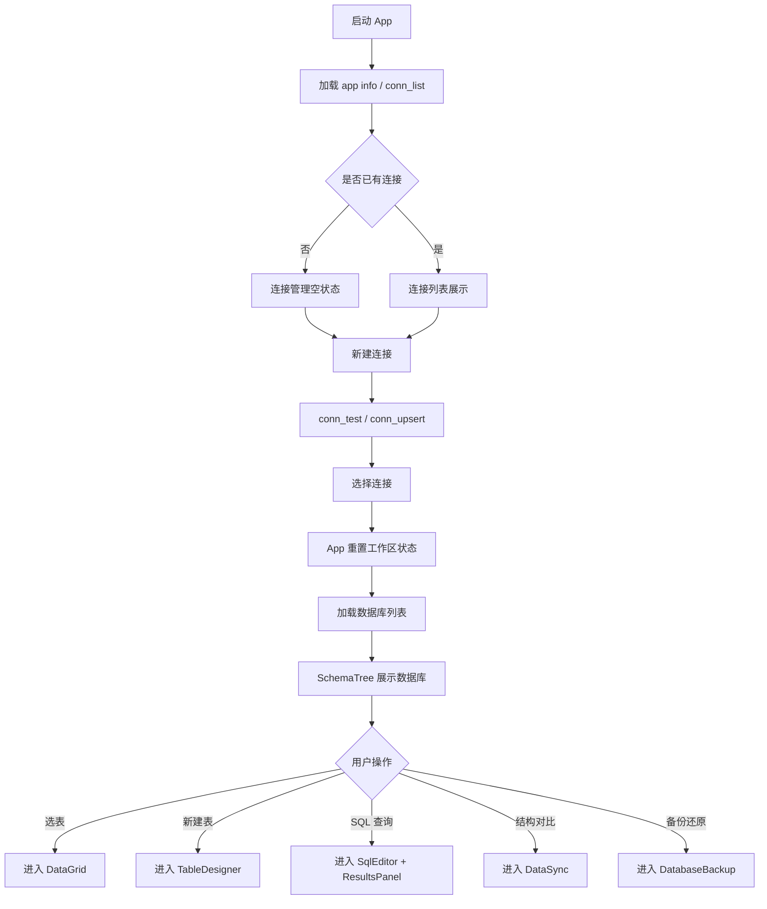
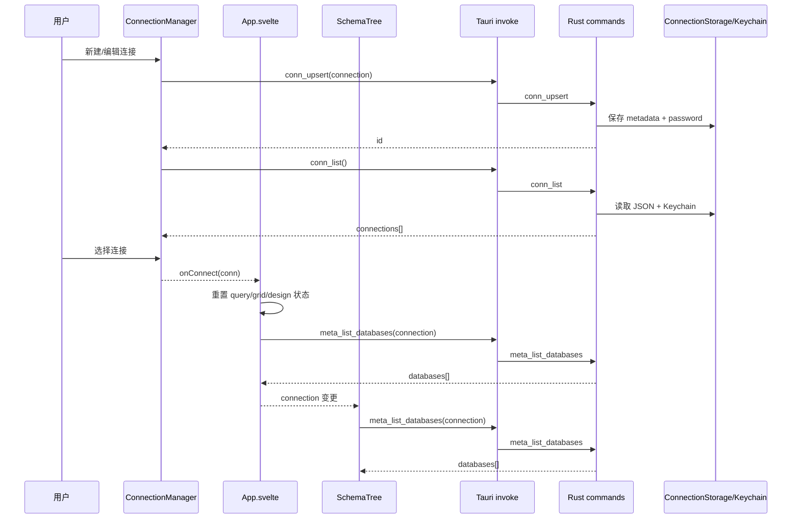
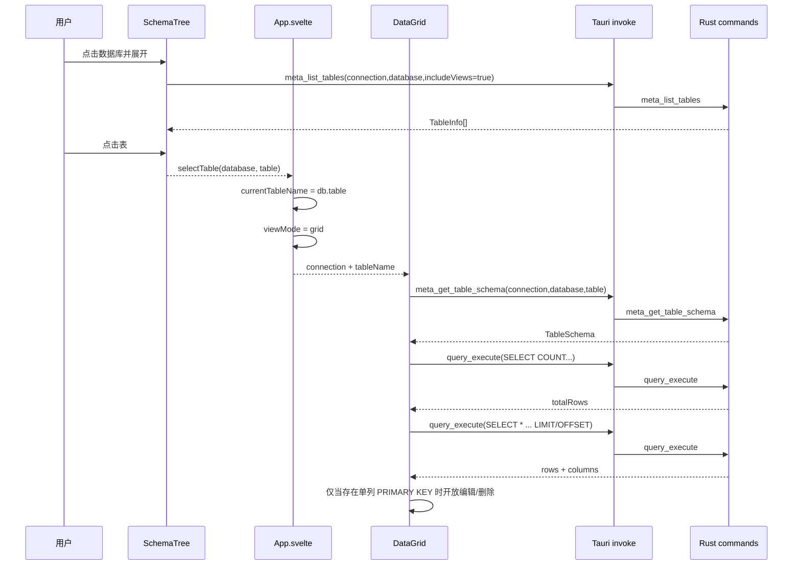
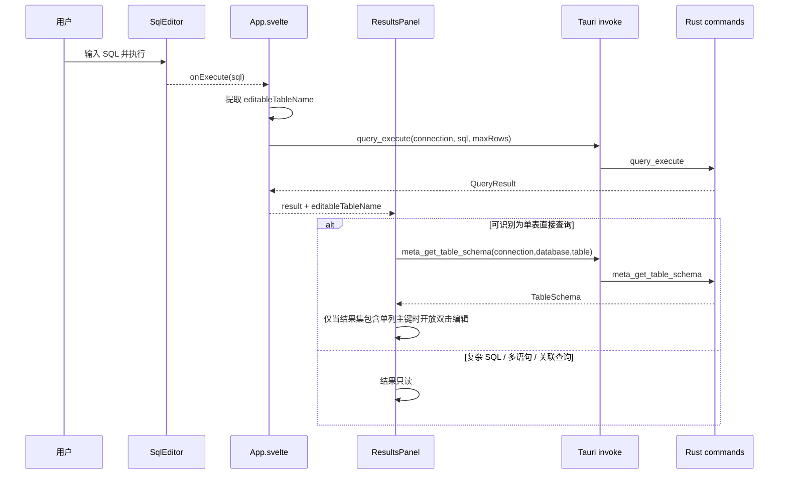
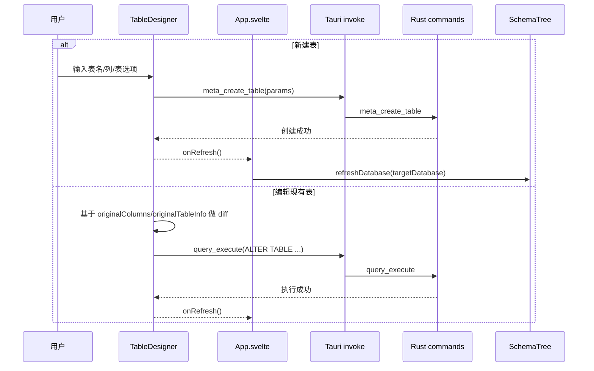

# QueryLab 核心功能逻辑审查

日期：2026-04-22

## 总体结论

本轮对 `连接管理 -> Schema 浏览 -> SQL 执行 -> 结果展示 -> 数据网格 -> 表设计 -> 备份还原 -> 结构对比` 做了逐链路核对。

当前结论：

- 主流程现在已经形成真实闭环，不再停留在“页面看起来能点”的阶段。
- 几个会直接影响正确性的逻辑问题已经修正，包括：
  - 删除连接后根状态未清空
  - 结果面板可能按旧表上下文误更新数据
  - Schema 树重命名表时可能丢失数据库上下文
  - 表设计器对现有表的变更检测不成立
  - 备份页把 `meta_list_tables` 返回的对象当字符串使用
  - 数据网格在无可靠主键定位时仍允许编辑/删除
- 当前仍有少量明确边界，需要按“受限能力”看待，而不是当成完整通用能力：
  - 结果面板编辑仅支持可识别的“单表直接查询”
  - 数据网格编辑/删除仅支持单列主键表
  - 结构对比仍是预览/结构 SQL 执行，不是真正数据同步
  - SQL 批量解析、SQL 导入解析对复杂 `DELIMITER`/过程语句仍不够稳

## 页面交互总流程

## 时序图

### 1. 连接与 Schema 装载

### 2. 选表进入数据网格

### 3. SQL 查询与结果面板编辑门禁

### 4. 表设计保存

## 当前核心逻辑判断

### 连接管理

- 现在逻辑正确：
  - 保存连接走 `conn_upsert`
  - 重启后连接列表通过 `conn_list` 从本地配置 + 钥匙串恢复
  - 删除已选中连接时，App 会清空当前工作区，不再残留旧表/旧结果
- 当前边界：
  - 表单里的“测试结果”仍是局部面板反馈，不是统一 toast 反馈

### Schema 浏览

- 现在逻辑正确：
  - 数据库和表列表加载链路真实接到 `meta_list_databases / meta_list_tables`
  - 右键删除/清空/重命名直接落到真实 SQL
  - 重命名表已固定使用当前数据库上下文，不再靠同名表猜库
- 当前边界：
  - 右键菜单仍偏“单库单表”视角，不支持跨库移动等复杂操作

### SQL 执行与结果展示

- 现在逻辑正确：
  - `SqlEditor -> App.executeQuery -> query_execute -> ResultsPanel` 闭环成立
  - 结果面板不会再因为“当前选中表”与“本次结果集来源表”不一致而误写数据
- 当前边界：
  - `query_execute` 仍是简单按 `;` 切分，多语句/过程体/自定义分隔符场景不稳
  - 复杂查询结果默认只读，这是有意的安全降级

### 数据网格

- 现在逻辑正确：
  - 进入网格前会先取表结构，再取总数和分页数据
  - 页面切换/刷新时会清掉旧选择和未提交临时行，避免把旧选择映射到新数据集
  - 无单列主键时已降级为只读，不再冒险做 update/delete
- 当前边界：
  - 复合主键表目前不支持网格编辑/删除
  - 插入仍然是通用 INSERT 拼接，不覆盖更复杂默认值/触发器语义

### 表设计器

- 现在逻辑正确：
  - 新建表走 `meta_create_table`
  - 编辑现有表时，使用原始快照对比，而不是把当前表面状态直接当 diff
  - 表选项变更（引擎/字符集/排序规则/注释）会进入保存链路
- 当前边界：
  - 仍聚焦单列主键
  - 索引/外键的可视化编辑仍未完整产品化

### 备份还原

- 现在逻辑正确：
  - 备份页加载表列表时已明确传 `includeViews: false`
  - `meta_list_tables` 返回的对象会正确映射为表名字符串，再传给 `db_export`
- 当前边界：
  - `db_import` 和 `query_execute` 一样，对复杂 SQL 文件的语句切分仍偏简化

### 结构对比（预览）

- 现在逻辑正确：
  - 定位明确为结构差异比较和结构 SQL 执行
  - 不再假装是真正的数据同步器
- 当前边界：
  - “新增表”仍提示手动补 CREATE TABLE
  - 不处理真实数据同步

## 本轮修正项

- `src/App.svelte`
  - 连接切换/删除时统一重置工作区状态
  - 为结果面板引入安全的 `editableTableName`
- `src/components/ResultsPanel.svelte`
  - 仅在单表直接查询且结果中包含单列主键时开放编辑
  - 新查询结果到达时重置结果页签状态
- `src/components/SchemaTree.svelte`
  - 修复重命名表时数据库上下文丢失问题
  - 连接为空时清空旧的 schema 状态
- `src/components/DataGrid.svelte`
  - 过滤条件转义
  - 无单列主键时禁止更新/删除
  - 切页/刷新时清理旧选择与未提交行
  - 单元格文本改为安全输出，不再直接渲染原始 HTML
- `src/components/TableDesigner.svelte`
  - 引入原始快照
  - 真实生成 add/drop/modify/change/pk/table-options 变更
  - 表选项改动会触发 `hasChanges`
- `src/components/DatabaseBackup.svelte`
  - 修复表列表参数与返回值适配
- `src/components/DataSync.svelte`
  - 清理残留浏览器 `alert()`

## 仍建议上线前继续补的点

1. 把 `query_execute` / `db_import` 的 SQL 分句能力从“简单 split”升级为真正 SQL 解析或逐段执行策略。
2. 对 `ResultsPanel` 和 `DataGrid` 增加“复合主键 / 无主键只读”明确提示文案和帮助说明。
3. 为 `TableDesigner` 增加回归测试，覆盖：
   - 列重命名
   - 主键切换
   - 表选项修改
   - 只改注释/默认值
4. 如果准备公开发布，建议再跑一轮 `tauri:dev` 手工链路验证：
   - 新建连接
   - 重启后读取连接
   - 选表看网格
   - SQL 查询
   - 新建表 / 编辑表
   - 备份导出 / 导入
